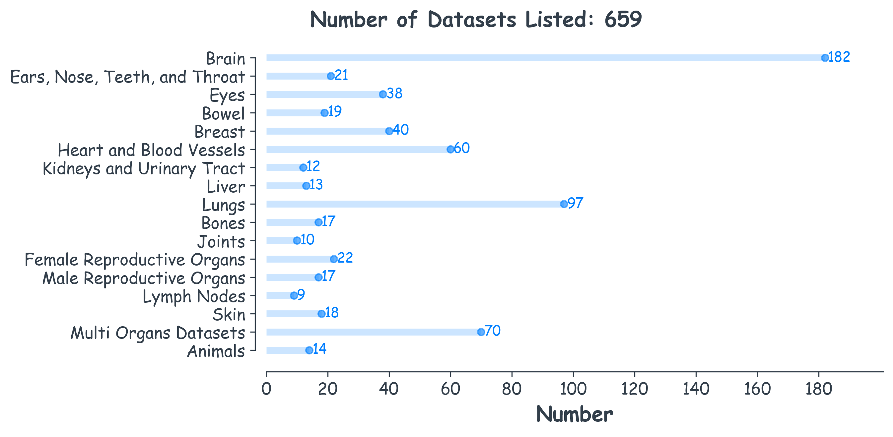

<h2> Awesome Public Medical Imaging Datasets </h2>

 ***Under construction: This list is being actively updated with additional datasets.***

## Table of Contents

- [Introduction](#introduction)
- [Head and Neck](#head-and-neck)
  - [Brain](#brain)
  - [Ears, Nose, Teeth, and Throat](#ears-nose-teeth-and-throat)
  - [Eyes](#eyes)
- [Chest and Abdomen](#chest-and-abdomen)
  - [Bowel](#bowel)
  - [Breast](#breast)
  - [Heart and Blood Vessels](#heart-and-blood-vessels)
  - [Kidneys and Urinary Tract](#kidneys-and-urinary-tract)
  - [Liver](#liver)
  - [Lungs](#lungs)
- [Musculoskeletal System](#musculoskeletal-system)
  - [Bones](#bones)
  - [Joints](#joints)
- [Pelvis and Reproductive Organs](#pelvis-and-reproductive-organs)
  - [Female Reproductive Organs](#female-reproductive-organs)
  - [Male Reproductive Organs](#male-reproductive-organs)
- [Other Organs and Systems](#other-organs-and-systems)
  - [Lymph Nodes](#lymph-nodes)
  - [Skin](#skin)
- [Multi Oragns Datasets](#multi-organs-datasets)
- [Notes and Contributions](#notes-and-contributions)

## Introduction

This repository is a collection of publicly available medical imaging datasets. It aims to provide a comprehensive and valuable resource for researchers, healthcare professionals, and developers working in the field of medical imaging analysis.

-  The link of leaderboard.
-  The link of related papers.
-  The licence of the dataset.

______

## Head and Neck

### Brain

- <a href="https://my.vanderbilt.edu/votem"> **3D VoTEM**</a> (3-D Validation of Tractography with Experimental MRI) 
It has three subset challenges. 
***Keyboard:*** Diffusion MRI, Labeled 

- <a href="https://academictorrents.com/details/5fc2f273123336ee34b9ea635ef8440377a42888"> **7-Tesla resting-state fMRI test-retest**</a> 
22 participants were scanned during two sessions spaced one week apart. 
***Keyboard:*** High field fMRI, Labeled  
 
 CC0

- <a href="http://www.med.harvard.edu/AANLIB"> **AANLIB**</a> 
Harward Atlas the Whole Brain  
***Keyboard:***  Multi-modality 
 Commercial reproduction or multiple distribution of any kind is prohibited.

- <a href="https://nda.nih.gov/edit_collection.html?id=3104"> **ABCD Neurocognitive Prediction**</a> 
T1-weighted MRI scans and fluid intelligence scores for children aged 9–10 year  
***Keyboard:***  MRI, Segmentation, Labeled   

- <a href="http://fcon_1000.projects.nitrc.org/indi/abide"> **ABIDE**</a> (Autism Brain Imaging Data Exchange)  
***Keyboard:*** Autism spectrum disorders (ASDs), MRI  
 
 CC BY-NC-SA 3.0

- <a href="http://fcon_1000.projects.nitrc.org/indi/ACPI/html/acpi_du_1.html"> **ACPI DU LaBar**</a> (Addiction Connectome Preprocessed Initiative) 
This dataset includes Scan Parameters, Demographic Information and Demographic Key 
 Creative Commons License: Attribution - Non-Commercial

- <a href="http://fcon_1000.projects.nitrc.org/indi/ACPI/html/acpi_mta_1.html"> **ACPI MTA**</a> (Addiction Connectome Preprocessed Initiative) 
Multimodal Treatment of Attention Deficit Hyperactivity Disorder (MTA) - Preprocessed 
 Creative Commons License: Attribution - Non-Commercial

- <a href="http://fcon_1000.projects.nitrc.org/indi/ACPI/html/acpi_nyu_1.html"> **ACPI NYU**</a> (Addiction Connectome Preprocessed Initiative) 
These data were collected to study functional and structural connectivity in cocaine addiction. This release contains R-fMRI and behavioral assessments and phenotypic information data from 29 cocaine-dependent individuals and 24 healthy comparison participants. 
 Creative Commons License: Attribution - Non-Commercial

- <a href="http://fcon_1000.projects.nitrc.org/indi/adhd200"> **ADHD-200**</a> (Attention Deficit Hyperactivity Disorder)  
776 resting-state fMRI and anatomical datasets aggregated across 8 independent imaging sites.  
 |  
 Consistent with the policies of the 1000 Functional Connectome Project

- <a href="https://adni.loni.usc.edu/data-samples/adni-data"> **ADNI**</a> (Alzheimer's Disease Neuroimaging Initiative)  
***Keyboard:*** Multi-modality  

- <a href="https://www.nitrc.org/projects/age-ility"> **Age-ility**</a> 
This data set consists of 136 subjects  
***Keyboard:*** MRI, EEG  
 
 Attribution Non-Commercial Share Alike

- <a href="https://openneuro.org/datasets/ds001907/versions/3.1.0"> **ANT**</a> 
It contains 46 healthy aging participants and participants with Parkinson's disease at two sessions each. 
***Keyboard:*** MRI  
 CC0

- <a href="https://nilab-uva.github.io/AOMIC.github.io"> **AOMIC**</a> (the Amsterdam Open MRI Collection)  
It is a collection of three datasets with multimodal (3T) MRI data  
***Keyboard:*** MRI  
<a href="https://www.nature.com/articles/s41597-021-00870-6">  Dataset is described </a>

- <a href="http://fcon_1000.projects.nitrc.org/indi/retro/atlas_R1.html"> **ATLAS R1.1**</a> (Anatomical Tracings of Lesions After Stroke)  
An dataset of 229 T1-weighted MRI scans (n=220) with manually segmented lesions and metadata. 

- <a href="https://atlas.grand-challenge.org"> **ATLAS R2.0**</a> (Anatomical Tracings of Lesions After Stroke)  
A larger dataset of T1w MRIs and manually segmented lesion masks  
***Keyboard:***  MRI, Segmentation, Labeled   
 | 

- <a href="http://fcon_1000.projects.nitrc.org/indi/retro/BeijingEnhanced.html"> **Beijing Enhanced**</a> 
These data include 180 healthy controls from a community sample.  
***Keyboard:*** resting state fMRI 
 Creative Commons License: Attribution - Non-Commercial

- <a href="http://fcon_1000.projects.nitrc.org/indi/pro/BeijingShortTR.html"> **Beijing Short TR Sample**</a> 
Data is obtained with a short TR (0.4 seconds) and a long TR (2.0 seconds). 
***Keyboard:*** Resting state fMRI 
 Creative Commons License: Attribution - Non-Commercial

- <a href="http://fcon_1000.projects.nitrc.org/indi/retro/BeijingEOEC.html"> **BeijingEOEC**</a> (Eyes Open Eyes Closed) 
These data include 48 healthy controls from a community (student) sample. \
***Keyboard:*** Resting state fMRI 
 Creative Commons License: Attribution - Non-Commercial

- <a href="https://github.com/White65534/BHSD"> **BHSD**</a> (Brain Hemorrhage Segmentation Dataset) 
A 3D multi-class ICH dataset containing 192 volumes with pixel-level annotations and 2200 volumes with slice-level annotations across five categories of ICH. 
***Keyboard:*** Intracranial hemorrhage (ICH), CT scan, Labeled 

- <a href="https://bigbrain.loris.ca/main.php"> **BigBrain**</a>  
Microscopic resolution 3D model of the human brain.  
***Keyboard:*** X-ray, Labeled  
 CC BY-NC-SA 4.0

- <a href="https://bonbid-hie2023.grand-challenge.org"> **BONBID-HIE**</a> (BOston Neonatal Brain Injury Dataset for Hypoxic Ischemic Encephalopathy)  
***Keyboard:***  MRI, Segmentation, Labeled   
 | <a href="https://www.biorxiv.org/content/10.1101/2023.06.30.546841v1">   Data Descriptor</a> 
 CC BY NC ND

- <a href="https://www.kaggle.com/datasets/ahmedhamada0/brain-tumor-detection"> **BR35H**</a> 
Brain Tumor Detection  
***Keyboard:***  MRI, Detection, Classification, Labeled   

- <a href="https://www.kaggle.com/datasets/sartajbhuvaji/brain-tumor-classification-mri"> **Brain Tumor Classification**</a>  
Classify MRI images into four classes  
***Keyboard:*** MRI, Labeled  

- <a href="https://www.kaggle.com/datasets/preetviradiya/brian-tumor-dataset"> **Brian Tumor Dataset**</a>  
This dataset consists of the scanned images of brain of patient diagnosed of brain tumour. 
***Keyboard:*** X-ray, Cancer, Labeled 
 GPL 2 

- <a href="https://figshare.com/articles/dataset/brain_tumor_dataset/1512427"> **brain tumor dataset**</a> 
Containing 3064 T1-weighted contrast-inhanced images from 233 patients with three kinds of brain tumor: meningioma, glioma, and pituitary tumor. 
***Keyboard:*** Cancer, MRI, Labeled  
 |  
 CC BY 4.0

- <a href="https://www.cancerimagingarchive.net/collection/brain-tumor-progression"> **Brain-Tumor-Progression**</a> 
Each patient had two MR exams acquired: within ninety days after completing chemi-radiation therapy and at the progression state which was based on the integration of the clinical performance and/or imaging outcomes. 
***Keyboard:*** Cancer, MRI, Labeled  

 TCIA Restricted

- <a href="https://aimi.stanford.edu/brainmetshare"> **BrainMetShare**</a>  
The dataset includes 156 whole brain MRI studies, including high-resolution, multi-modal pre- and post-contrast sequences in patients with at least 1 brain metastasis. 
***Keyboard:*** Detection, MRI, Segmentation, Labeled 
 
 Their Research Use Agreement, as well as to the Terms of Use of the Stanford University School of Medicine website

- <a href="https://brainptm-2021.grand-challenge.org"> **BrainPTM 2021**</a> (Brain Pre-surgical white matter Tractography Mapping)  
Data consists of 75 cases 
***Keyboard:*** MRI, Cancer, Segmentation, Labeled   

- <a href="https://www.brainsimagebank.ac.uk"> **BRAINS**</a> (Brain Images of Normal Subjects)  
***Keyboard:*** MRI  

- <a href="https://www.smir.ch/BRATS/Start2012"> **BRATS2012**</a> (Brain Tumor Segmentation)  
The tumor and edema regions have been manually delineated. 
***Keyboard:*** Multimodal MRI, Cancer, Labeled  

- <a href="https://www.smir.ch/BRATS/Start2013"> **BRATS2013**</a> (Brain Tumor Segmentation)  
A collection of 60 de-identified clinical cases.l2 
***Keyboard:*** Multiparametric, MRI, Cancer, Labeled  

- <a href="https://www.smir.ch/BRATS/Start2014"> **BRATS2014**</a> (Brain Tumor Segmentation)  
***Keyboard:*** MRI, Cancer, Labeled  

- <a href="https://www.smir.ch/BRATS/Start2015"> **BRATS2015**</a> (Brain Tumor Segmentation)  
***Keyboard:*** MRI, Cancer, Labeled  

- <a href="https://www.med.upenn.edu/sbia/brats2017/data.html"> **BRATS2017**</a> (Brain Tumor Segmentation)  
***Keyboard:*** MRI, Cancer, Labeled  

- <a href="https://www.med.upenn.edu/sbia/brats2018/data.html"> **BRATS2018**</a> (Brain Tumor Segmentation)  
The dataset utilizes multi-institutional pre-operative MRI scans and focuses on the segmentation of intrinsically heterogeneous brain tumors. Furthemore, it also focuses on the prediction of patient overall survival, via integrative analyses of radiomic features and machine learning algorithms.  
***Keyboard:*** MRI, Cancer, Labeled  

- <a href="https://www.med.upenn.edu/cbica/brats-2019"> **BRATS2019**</a> (Brain Tumor Segmentation)  
***Keyboard:*** MRI, Cancer, Labeled  

- <a href="https://www.med.upenn.edu/cbica/brats2020"> **BRATS2020**</a> (Brain Tumor Segmentation)  
***Keyboard:*** MRI, Cancer, Labeled  

- <a href="http://www.braintumorsegmentation.org"> **BRATS2021**</a> (Brain Tumor Segmentation)  
***Keyboard:*** MRI, Cancer, Labeled  

- <a href="https://www.synapse.org/brats2022"> **BRATS2022**</a> (Brain Tumor Segmentation)  
***Keyboard:*** MRI, Cancer, Labeled  

- <a href="https://synapse.org/brats2023"> **BRATS2023**</a> (Brain Tumor Segmentation)  
This version addressing additional, populations, tumors (e.g., meningioma), clinical concerns, and technical considerations.  
***Keyboard:*** MRI, Cancer, Labeled  

- <a href="https://cada.grand-challenge.org"> **CADA**</a> (Cerebral Aneurysm Detection and Analysis)  
Data of patients with cerebral aneurysms without vasospasm were collected for diagnostic and treatment decision purposes. 
***Keyboard:*** X-ray rotational angiography (3DRA), Segmentation, Labeled   
 |  
 CC BY-NC-ND 4.0

- <a href="https://caddementia.grand-challenge.org"> **CADDementia**</a> (Computer-Aided Diagnosis of Dementia)  
***Keyboard:*** Alzheimer's disease (AD), MRI   
 |  |  
 The data of the evaluation framework may only be used for the evaluation of methods for computer-aided diagnosis dementia through this challenge.

- <a href="https://sites.google.com/view/calgary-campinas-dataset/home"> **Calgary-Campinas**</a>  
It is comprised of 359 datasets, approximately 60 subjects per vendor and magnetic field strength. 
***Keyboard:*** MRI, Segmentation, Labeled 
 | 

- <a href="https://camcan-archive.mrc-cbu.cam.ac.uk/dataaccess"> **Cam-CAN**</a> (Cambridge Centre for Ageing and Neuroscience)  
Nearly 700 adults were scanned using structural Magnetic Resonance Imaging, functional MRI, magnetoencephalography, and completed multiple cognitive experiments.  
***Keyboard:*** lifespan, MRI, fMRI, MEG  
 | 

- <a href="https://cause07.grand-challenge.org"> **CAUSE07**</a> (Caudate Segmentation Evaluation 2007) 
***Keyboard:*** MRI 
 CC0

- <a href="https://openneuro.org/datasets/ds002207/versions/1.0.0"> **CEREBRuM**</a> (Convolutional Encoder-decodeR for Fully Volumetric Fast sEgmentation of BRain MRI) 
 
 CC0

- <a href="https://openfmri.org/dataset/ds000174"> **Changes Associated with Heavy Cannabis Use**</a>  
T1-weighted structural MRI study of cannabis users at baseline and 3 years follow up. 
***Keyboard:*** MRI 
 
 CC BY-NC

- <a href="http://fcon_1000.projects.nitrc.org/indi/retro/ClevelandCCF.html"> **Cleveland CCF**</a> 
It includes 31 control adults (11M/20F; ages: 24-60). In addition to the resting state scan this sample includes physiological measurements (heart rate and breathing) obtained during the resting state scan. 
***Keyboard:*** Resting state fMRI (R-fMRI) 
 Creative Commons License: Attribution - Non-Commercial

- <a href="http://fcon_1000.projects.nitrc.org/indi/cmi_healthy_brain_network"> **CMI-HBN**</a> (Child Mind Institute Healthy Brain Network)  
Data from 10,000 children and adolescents (ages 5-21).  
***Keyboard:*** Neuroimaging, MRI, EEG  
<a href="https://www.nature.com/articles/sdata2017181">  Data Descriptor</a> 

- <a href="http://fcon_1000.projects.nitrc.org/indi/retro/cobre.html"> **COBRE**</a> (Center for Biomedical Research Excellence) 
functional MR data from 72 patients with Schizophrenia and 75 healthy controls (ages ranging from 18 to 65 in each group) 
***Keyboard:*** fMRI  
 Attribution - Non-Commercial

- <a href="https://physionet.org/content/ct-ich"> **Computed Tomography Images for Intracranial Hemorrhage Detection and Segmentation**</a> 
A dataset of 82 CT scans was collected, including 36 scans for patients diagnosed with intracranial hemorrhage (ICH). 
***Keyboard:*** CT scan, Labeled 
 
 PhysioNet Restricted Health Data License 1.5.0

- <a href="http://fcon_1000.projects.nitrc.org/indi/CoRR/html"> **CoRR**</a> (Consortium for Reliability and Reproducibility)  
It has aggregated 1,629 typical individuals resting state fMRI data.  
***Keyboard:*** Resting state fMRI (rfMRI)  

- <a href="https://www.cancerimagingarchive.net/collection/cptac-gbm"> **CPTAC-GBM**</a> (Clinical Proteomic Tumor Analysis Consortium Glioblastoma Multiforme) 
***Keyboard:*** Multi-modality, Cancer  
 CC BY 3.0 - TCIA Restricted

- <a href="http://headctstudy.qure.ai"> **CQ500**</a>  
A dataset of 491 scans with 193,317 slices  
***Keyboard:*** CT Scan  

- <a href="https://openneuro.org/datasets/ds002236/versions/1.1.1"> **Cross-Sectional Multidomain Lexical Processing**</a> 
This dataset explores the neural mechanisms and development of lexical processing through task based fMRI of rhyming, spelling, and semantic judgement tasks in both the auditory and visual modalities. 
***Keyboard:*** fMRI  
 
 CC0

- <a href="https://crossmoda.grand-challenge.org"> **crossMoDA 2021**</a> (Cross-Modality Domain Adaptation)  
The goal is to segment two key brain structures involved in the follow-up and treatment planning of vestibular schwannoma (VS): the tumour and the cochlea 
***Keyboard:*** MRI, Segmentation  
 | 

- <a href="https://crossmoda2022.grand-challenge.org"> **crossMoDA 2022**</a> (Cross-Modality Domain Adaptation)  
The goal is to segment two key brain structures involved in the follow-up and treatment planning of vestibular schwannoma (VS): the tumour and the cochlea, and to automatically classify hrT2 images with VS according to the Koos grade 
***Keyboard:*** MRI, Segmentation  

- <a href="https://www.synapse.org/#!Synapse:syn51236108/wiki/621615"> **crossMoDA 2023**</a> (Cross-Modality Domain Adaptation)  
The 2023 edition extends the segmentation task by including multi-institutional, heterogenous data acquired for routine surveillance purposes and introduces a sub-segmentation for the tumour (intra- and extra-meatal components) thereby leading to a 3 class problem.  
***Keyboard:*** MRI, Segmentation  

- <a href="http://fcon_1000.projects.nitrc.org/indi/retro/CUNMET.html"> **CUNMET**</a> (Clínica Universidad de Navarra Methylphenidate) 
Examination of the neural correlates of differential treatment response to stimulants (methylphenidate and lisdexamfetamine) in boys and girls with ADHD treated in a naturalistic context. 
***Keyboard:*** MRI, Resting state fMRI, Perfusion/arterial spin labeling (ASL) 

- <a href="https://www.ncbi.nlm.nih.gov/projects/gap/cgi-bin/study.cgi?study_id=phs000607.v3.p2"> **dbGaP**</a> (Genotypes and Phenotype) 
Study about Neurodevelopmental Genomics: Trajectories of Complex Phenotypes 
***Keyboard:*** MRI, Multimodal Neuroimaging  
 | 

- <a href="https://www.cancerimagingarchive.net/collection/dfci-bch-bwh-peds-hgg"> **DFCI-BCH-BWH-PEDs-HGG**</a>  
MR imaging of pediatric subjects with high-grade gliomas. It is a subset of the BraTS-PEDs 2023 challenge 
***Keyboard:*** Cancer  
 CC BY 4.0

- <a href="http://fcon_1000.projects.nitrc.org/indi/retro/dlbs.html"> **DLBS**</a> (Dallas Lifespan Brain Study) 
350 healthy adults, aged 20-89 who are thoroughly characterized in terms of cognition, brain structure and brain function across the adult lifespan 
***Keyboard:*** MRI, PET, Cognitive Data  
 Attribution - Non-Commercial

- <a href="https://xnat.bmia.nl/data/archive/projects/egd"> **EGD**</a> (Erasmus Glioma Database) 
It is a collection of 774 patients with glioma. 
***Keyboard:*** MRI, Cancer 

- <a href="https://rdr.ucl.ac.uk/articles/dataset/EPISURG_a_dataset_of_postoperative_magnetic_resonance_images_MRI_for_quantitative_analysis_of_resection_neurosurgery_for_refractory_epilepsy/9996158"> **EPISURG**</a>  
A dataset of postoperative MRI images for quantitative analysis of resection neurosurgery for refractory epilepsy.  
 
 CC BY-NC-SA 4.0

- <a href="https://feta.grand-challenge.org"> **FeTA**</a> (Fetal Tissue Annotation)  
A dataset of manually segmented pathological and non-pathological fetal magnetic resonance brain volume reconstructions across a range of gestational ages into different tissue categories  
***Keyboard:*** MRI, Labeled, Segmentation  

- <a href="http://fcon_1000.projects.nitrc.org/indi/retro/find_stanford.html"> **FIND Lab**</a> ( Functional Imaging in Neuropsychiatric Disorders) 
This dataset is comprised of 13 subjects, ages 18-29, 8 female, with both strutural and functional MRI. The functional paradigms collected are as Episodic Memory, Music, Subtraction 
 
 Creative Commons License: Attribution - Non-Commercial

- <a href="http://niftyweb.cs.ucl.ac.uk/program.php?p=CHALLENGE"> **GMSC**</a> (Grey matter segmentation challenge) 
***Keyboard:*** MRI, Labeled 
 
 Data is intended for research and educational purposes only

- <a href="https://zenodo.org/records/1206163"> **Gray matter segmentation at 7T MRI**</a>  
The dataset consist of 7 Tesla MRI anatomical images of living human brains and hand labeled cortical gray matter images.  
***Keyboard:*** High field MRI, Labeled, Segmentation  
 
 CC BY 4.0

- <a href="https://www.neuroinfo.org/gsp"> **GSP**</a> (Genomics Superstruct Project)  
Personality and cognitive measures were obtained on a subset of participants. Each dataset contains a T1-weighted structural MRI scan and either one (n=1,570) or two (n=1,139) resting state functional MRI scans.  
***Keyboard:*** MRI  

- <a href="http://hardi.epfl.ch/static/events/2012_ISBI"> **HARDI 2012**</a> 
***Keyboard:*** Diffusion MRI 

- <a href="http://hardi.epfl.ch/static/events/2013_ISBI"> **HARDI 2013**</a>  
It focuses on the effect of the local reconstruction accuracy on the quality of connectivity reconstruction.  
***Keyboard:*** Diffusion MRI  

- <a href="http://fcon_1000.projects.nitrc.org/indi/hbn_ssi"> **HBN-SSI**</a> (Healthy Brain Network Serial Scanning Initiative) 
The primary goal is to assess and compare test-retest reliabilities for full-brain connectivity patterns derived from functional MRI data obtained during different scan conditions. 

- <a href="http://www.humanconnectomeproject.org"> **HCP**</a> (Human Connectome Project) 
***Keyboard:*** MRI 

- <a href="https://www.kaggle.com/datasets/felipekitamura/head-ct-hemorrhage"> **Head CT - hemorrhage**</a> 
This dataset contains 100 normal head CT slices and 100 other with hemorrhage. No distinction between kinds of hemorrhage.  
***Keyboard:*** CT scan, Labeled  
 CC0: Public Domain

- <a href="https://www.kaggle.com/datasets/andrewmvd/hippocampus-segmentation-in-mri-images"> **Hippocampus Segmentation**</a> 
This dataset contains T1-weighted MR images of 50 subjects, 40 of whom are patients with temporal lobe epilepsy and 10 are nonepileptic subjects.  
***Keyboard:*** MRI, Labeled  
 
 The dataset is free to use for research and education.

- <a href="https://www.nitrc.org/projects/ibsr/"> **IBSR**</a> (Internet Brain Segmentation Repository)   
Manually-guided expert segmentation results along with magnetic resonance brain image data   
***Keyboard:*** MRI, Labeled  
 Free For Non-Commercial Use Only

- <a href="https://instance.grand-challenge.org"> **INSTANCE2022**</a> (INtracranial
hemorrhage SegmenTAtioN ChallengE)  
A training set of 100 cases with ground-truth and a validation set with 30 cases without ground-truth labels. 
***Keyboard:*** Intracranial hemorrhage (ICH), CT Scan, Labeled   
 | 

- <a href="https://iseg2017.web.unc.edu"> **iSeg2017**</a>  
6 month old Infant Brain Segmentation 
***Keyboard:*** MRI, Labeled   
 | 

- <a href="https://iseg2019.web.unc.edu"> **iSeg2019**</a>  
6 month old Infant Brain Segmentation 
***Keyboard:*** MRI, Labeled   
 | 

- <a href="http://www.isles-challenge.org"> **ISLES**</a> (Ischemic Stroke Lesion Segmentation)  
It has multi versions in 2015 to 2018  
***Keyboard:*** MRI  

- <a href="https://isles22.grand-challenge.org"> **ISLES'22**</a> (Ischemic Stroke Lesion Segmentation)  
Multimodal MRI infarct segmentation in acute and sub-acute stroke 
***Keyboard:*** MRI  

- <a href="https://brain-development.org/ixi-dataset"> **IXI**</a> 
This dataset have been collected nearly 600 MR images from normal, healthy subjects. 
***Keyboard:*** MRI 
 CC BY-SA 3.0

- <a href="https://www.cancerimagingarchive.net/collection/lgg-1p19qdeletion"> **LGG-1p19qDeletion**</a> 
It performed in 159 subjects with Low Grade Gliomas.  
***Keyboard:*** MRI, Segmentation, Labeled 
 
 TCIA Restricted - CC BY 3.0

- <a href="https://openneuro.org/datasets/ds001486"> **Longitudinal Neuroimaging on Arithmetic Processing**</a> 
Brain Correlates of Math Development in Children.  
***Keyboard:*** MRI  
 
 CC0

- <a href="https://openneuro.org/datasets/ds001894"> **Longitudinal Neuroimaging on Multisensory Lexical Processing**</a> 
Longitudinal Brain Correlates of Multisensory Lexical Processing in Children.  
***Keyboard:*** MRI  
 
 CC0

- <a href="https://zenodo.org/records/7523691"> **M4Raw**</a> 
A multi-contrast, multi-repetition, multi-channel MRI k-space dataset for low-field MRI research.  
***Keyboard:*** 0.3 Tesla MRI  
 
 CC BY 4.0

- <a href="https://openneuro.org/datasets/ds000239"> **Maclaren test-retest brain volume**</a> 
The dataset comprises three participants, each of whom was scanned 40 times. 
***Keyboard:*** MRI 
 
 CC0

- <a href="https://www.massive-data.org/massive-data"> **MASSIVE**</a> (Multiple Acquisitions for Standardization of Structural Imaging Validation and Evaluation) 
The database consist of 8000 diffusion-weighted volumes and ten 3D FLAIR, T1-, and T2-weighted datasets of a single healthy subject.  
***Keyboard:*** diffusion MRI  

- <a href="https://my.vanderbilt.edu/memento"> **MEMENTO**</a> (Mri whitE Matter rEcoNstrucTiOn) 
The aim is evaluating and advancing the state of the microstructural modeling field. 
***Keyboard:*** Diffusion MRI 

- <a href="https://portal.conp.ca/dataset?id=projects/mica-mics"> **MICA-MICs**</a> (Microstructure-Informed Connectomics) 
The dataset provides raw and fully processed multimodal neuroimaging data acquired in 50 healthy control participants at a filed strength of 3T.  
***Keyboard:*** multimodal MRI  
 
 CC0

- <a href="https://mindboggle.info/data.html"> **Mindboggle**</a>   
Manually labeled human brain image data.  
***Keyboard:*** MRI, Labeled  
 
 CC BY 4.0

- <a href="https://www.ucl.ac.uk/drc/research-clinical-trials/minimal-interval-resonance-imaging-alzheimers-disease-miriad"> **MIRIAD**</a> (Minimal Interval Resonance Imaging in Alzheimer's Disease)  
Dataset is a series of longitudinal volumetric T1 MRI scans of 46 mild–moderate Alzheimer's subjects and 23 controls.  
***Keyboard:*** Alzheimer's disease (AD), MRI  
<a href="https://www.sciencedirect.com/science/article/pii/S105381191201230X">  Overview </a> 
 BIRN Data License

- <a href="https://www.nitrc.org/projects/multimodal"> **MMRR**</a> (Multi-Modal MRI Reproducibility Resource) 
Scan-rescan imaging sessions on 21 healthy volunteers.  
***Keyboard:*** MRI, resting state fMRI  

- <a href="https://openneuro.org/datasets/ds000221"> **MPILMBB**</a> (MPI-Leipzig Mind-Brain-Body) 
A functional connectome phenotyping dataset including cognitive state and personality measures.  
***Keyboard:*** MRI, Cognitive Data  
 
 CC0

- <a href="http://fcon_1000.projects.nitrc.org/indi/retro/MPI_LEMON.html"> **MPI-LEMON**</a> 
It presents a dataset of 228 healthy participants comprising a young and an elderly group acquired cross-sectionally to study mind-body-emotion interactions. 
***Keyboard:*** MRI, EEG 

- <a href="https://mrbrains13.isi.uu.nl"> **MRBrainS13**</a>  
Evaluation Framework for Brain Image Segmentation in 3T MRI Scans 

- <a href="https://mrbrains18.isi.uu.nl/"> **MRBrainS18**</a>  
The purpose is to directly compare methods for segmentation of gray matter, white matter, cerebrospinal fluid, and other structures on 3T MRI scans of the brain, and to assess the effect of (large) pathologies on segmentation and volumetry. 

- <a href="https://www.kaggle.com/datasets/jboysen/mri-and-alzheimers"> **MRI and Alzheimers**</a> 
Magnetic Resonance Imaging Comparisons of Demented and Nondemented Adults 
***Keyboard:*** Alzheimer's Disease (AD), Labeled 

- <a href="https://www.kaggle.com/datasets/sabermalek/mrihs"> **MRI Hippocampus Segmentation**</a>  
All images are for people suffering from Alzheimer's. 
***Keyboard:*** MRI, Segmentation, Alzheimer's Detection 
 CC BY-NC-SA 4.0

- <a href="https://iacl.ece.jhu.edu/index.php/MSChallenge"> **MS**</a> (Multiple sclerosis)  
82 data sets had the white matter lesions associated with multiple sclerosis delineated by two human expert raters.  
***Keyboard:*** MRI, Labeled, Segmentation  
 | 

- <a href="https://openneuro.org/datasets/ds000224"> **MSC**</a> (Midnight Scan Club) 
This dataset focused on the precise characterization of ten individual subjects via collection of large amounts of per-individual data. 
***Keyboard:*** Resting-state fMRI, MRI, Neuropsychological testing 
 
 CC0

- <a href="https://www.nitrc.org/projects/msseg"> **MSSeg 2008**</a> 
The goal is to compare algorithms to segment the multiple sclerosis (MS) lesions. 
***Keyboard:*** MRI, Segmentation 

- <a href="https://portal.fli-iam.irisa.fr/msseg-challenge"> **MSSEG 2016**</a> 
A total of 100 multiple sclerosis patients 
***Keyboard:*** MRI, Segmentation 

- <a href="https://www.smir.ch/MTOP/Start2016"> **MTOP2016**</a> (Mild Traumatic Brain Injury Outcome Prediction)  
***Keyboard:*** MRI, Labeled  

- <a href="https://figshare.com/articles/dataset/Multicenter_dataset_of_multishell_diffusion_magnetic_resonance_imaging_in_healthy_traveling_adults_with_identical_setting/8851955"> **Multi-shell diffusion MRI**</a> 
It was collected from three traveling subjects with identical acquisition setting in ten imaging centers.  
***Keyboard:*** MRI  
 
 CC BY 4.0

- <a href="http://fcon_1000.projects.nitrc.org/indi/pro/wchsu_li_index.html"> **Multimodal MRI of chess players**</a> 
It is a MRI dataset of 29 professional Chinese chess players. 
 Creative Commons License: Attribution - Non-Commercial

- <a href="http://fcon_1000.projects.nitrc.org/indi/retro/Narratives.html"> **Narratives**</a> 
fMRI data for evaluating models of naturalistic language comprehension.  
***Keyboard:*** fMRI, Labeled  
 CC0

- <a href="http://fcon_1000.projects.nitrc.org/indi/retro/nat_view.html"> **Naturalistic Viewing**</a> 
The dataset represents simultaneously collected electroencephalography (EEG) and function magnetic resonance imaging (fMRI) recordings obtained from 22 individuals between the ages of 23 and 51 years-old. 
 
 CC BY 4.0

- <a href="http://fcon_1000.projects.nitrc.org/indi/retro/NEO2012.html"> **NEO2012**</a> 
The dataset consists of male and female adults, all healthy controls with no psychiatric history used in the 2011 PLoS ONE study. 
 
 Creative Commons License: Attribution - Non-Commercial

- <a href="http://www.neuromorphometrics.com/?page_id=23"> **NeuAtlas Labeled Brain Scans**</a> 
***Keyboard:*** MRI, Labeled, Segmentation  

- <a href="fcon_1000.projects.nitrc.org/indi/retro/Power2012.html"> **NeuroImage article by Power et al.**</a> 
The dataset consists of children, adolescents, and adults, all of which are controls with no diagnosis. 
***Keyboard:*** MRI 
 
 Creative Commons License: Attribution - Non-Commercial

- <a href="https://openneuro.org/datasets/ds001021"> **NKI-RS**</a> (Nathan Kline Institute-Rockland Sample) 
NKI-RS is an ongoing, institutionally centered endeavor aimed at creating a large-scale (N > 1000), deeply phenotyped, community-ascertained, lifespan sample (ages 6–85 years old) with advanced neuroimaging and genetics.  
***Keyboard:*** MRI 

- <a href="http://fcon_1000.projects.nitrc.org/indi/retro/NorthShoreLIJ.html"> **North Shore - LIJ**</a> 
It includes 6 patients with medically intractable epilepsy that underwent implantation of intracranial electrodes for seizure onset localization prior to resective neurosurgery. 
***Keyboard:*** Resting state fMRI (R-fMRI) 
 
 Creative Commons License: Attribution - Non-Commercial

- <a href="http://www.naturalscenesdataset.org"> **NSD**</a> (Natural Scenes Dataset)  
High-resolution fMRI responses to tens of thousands of richly annotated natural scenes  
***Keyboard:*** fMRI, Labeled  
<a href="https://www.nature.com/articles/s41593-021-00962-x"> Description of the dataset</a>

- <a href="http://fcon_1000.projects.nitrc.org/indi/pro/nyu.html"> **NYUIQ**</a> 
It consists of datasets from 49 psychiatrically neurotypical adults, with age, gender and intelligence quotient (IQ) information provided. 
***Keyboard:*** T1 weighted MRI, Resting state fMRI scans (R-fMRI) 
 Creative Commons License: Attribution - Non-Commercial

- <a href="https://oasis-brains.org"> **OASIS**</a> (Open Access Series of Imaging Studies)  
It has multi versions.  
***Keyboard:*** Multi modality, Neuroimaging  
 |  |  | 

- <a href="http://fcon_1000.projects.nitrc.org/indi/retro/parkinsons.html"> **Parkinson's Disease Datasets**</a> 
The data are comprised of 27 PD patients and 16 age-matched normal controls in the Neurocon dataset, and 20 PD patients and 20 age-matched controls in the Tao Wu dataset. Both sets contain T1 and resting-state scans. 
 
 CC BY-NC-SA

- <a href="https://zenodo.org/records/5749645"> **PERFORM**</a> 
Functional Magnetic Resonance Imaging (fMRI), electroencephalography (EEG), sleep and nutrition assessments were performed on one male control subject. 

- <a href="https://www.nitrc.org/projects/ping"> **PING**</a> (Pediatric Imaging, Neurocognition, and Genetics) 
The study includes 1400 children between the ages of 3 and 20 years so that links between genetic variation and developing patterns of brain connectivity can be examined.  
***Keyboard:*** MRI 

- <a href="https://www.ppmi-info.org"> **PPMI**</a> (Parkinson’s Progression Markers Initiative) 
Data from Parkinson’s Disease, Prodromal Cohort, and Healthy Controls.  

- <a href="https://f1000research.com/articles/6-93/v2"> **Prenatal brain**</a> 
It was collected from three traveling subjects with identical acquisition setting in ten imaging centers.  
***Keyboard:*** fetal MRI, Segmentation  
 CC0 1.0

- <a href="https://openpreventad.loris.ca"> **PREVENT-AD**</a> (Pre-symptomatic Evaluation of Experimental or Novel Treatments for Alzheimer Disease)  
***Keyboard:*** MRI, Labeled  
 |  | 

- <a href="http://fcon_1000.projects.nitrc.org/indi/pro/Quiron-Valencia.html"> **Quiron-Valencia**</a> 
The first release includes data for 45 participants. Each participant has an anatomical as well as a resting state fMRI scan. 
***Keyboard:*** Resting state fMRI (R-fMRI) 
 Creative Commons License: Attribution - Non-Commercial

- <a href="https://realnoisemri.grand-challenge.org"> **RealNoiseMRI**</a>  
Evaluating the performance of markerless prospective motion correction and selective reacquisition in a general clinical protocol  
***Keyboard:*** MRI  
 CC0

- <a href="https://www.cancerimagingarchive.net/collection/rembrandt"> **REMBRANDT**</a> 
It contains data generated through the Glioma Molecular Diagnostic Initiative from 874 glioma specimens comprising approximately 566 gene expression arrays, 834 copy number arrays, and 13,472 clinical phenotype data points.  
***Keyboard:*** MRI 
 TCIA Restricted - CC BY 3.0

- <a href="https://archive.norstore.no/pages/public/datasetDetail.jsf?id=10.11582/2017.00004"> **RESECT**</a> (REtroSpective Evaluation of Cerebral Tumors)   
A clinical database of pre-oper, ative MRI and intra-operative ultrasound in low-grade glioma surgeries  
***Keyboard:*** Cancer, Registration, Labeled  
 
 CC BY 4.0

- <a href="https://www.cancerimagingarchive.net/collection/rider-neuro-mri"> **RIDER NEURO MRI**</a> (Reference Image Database to Evaluate Therapy Response) 
It contains data on 19 patients with recurrent glioblastoma who underwent repeat imaging sets. 
***Keyboard:*** Cancer 
 TCIA Restricted - CC BY 3.0

- <a href="https://www.rsna.org/rsnai/ai-image-challenge/brain-tumor-ai-challenge-2021"> **RSNA Brain Tumor**</a> (Radiological Society of North America 2021)  
A dataset for brain tumor segmentation and radiogenomic classification  
***Keyboard:*** MRI, Labeled  

- <a href="https://www.rsna.org/rsnai/ai-image-challenge/rsna-intracranial-hemorrhage-detection-challenge-2019"> **RSNA Intracranial Hemorrhage Detection**</a> (Radiological Society of North America 2019)  
A dataset of more than 25,000 annotated cranial CT exams  
***Keyboard:*** CT scan, Labeled 

- <a href="http://fcon_1000.projects.nitrc.org/indi/retro/sald.html"> **SALD**</a> (Southwest University Adult Lifespan Dataset) 
494 healthy adults (age range: 19-80 years; Males=187) were recruited and completed two multi-modal MRI scan sessions.  
***Keyboard:*** MRI, resting-state functional MRI (rs-fMRI) 
<a href="https://www.biorxiv.org/content/10.1101/177279v2">  Detailed description </a> 
 Creative Commons License: Attribution - Non-Commercial

- <a href="https://openneuro.org/datasets/ds001378/versions/00003"> **SCA2 Diffusion Tensor Imaging**</a> 
Nine SCA2 (Spinocerebellar ataxia type II) patients and 16 age-matched healthy controls, were examined twice on the same 1.5T MRI scanner 
 
 CC-BY 4.0

- <a href="https://shifts.grand-challenge.org"> **Shifts Challenge 2022**</a> 
White Matter Multiple Sclerosis (MS) lesion segmentation in 3D Magnetic Resonance Imaging (MRI) of the brain  
***Keyboard:*** MRI  

- <a href="http://fcon_1000.projects.nitrc.org/indi/retro/SIMON.html"> **SIMON**</a> (Single Individual volunteer for Multiple Observations across Networks) 
A sample of convenience of one healthy male aged between 29 and 46 years old, scanned in 73 sessions at multiple sites and with various scanner models. 
***Keyboard:*** MRI 
 CC BY-SA

- <a href="https://stanfordaimi.azurewebsites.net/datasets/3de8cef8-0626-4c5d-ac47-ed0fed22ac99"> **SinoCT**</a> 
This dataset contains over 9,000 head CT scans, each labeled as normal or abnormal. Each scan contains a reconstructed image and a corresponding sinogram. 
***Keyboard:*** Labeled  
 
 Stanford university dataset research use aggrement

- <a href="https://slcn.grand-challenge.org"> **SLCN**</a> (Surface Learning for Clinical Neuroimaging)   
Part of the <a href="http://www.developingconnectome.org"> dHCP</a> (Developing Human Connectome Project)  
***Keyboard:*** MRI  

- <a href="https://www.studyforrest.org"> **StudyForrest**</a>  
A Collection of datasets  
<a href="https://www.studyforrest.org/publications.html">  List of publications</a> 
 ODC Public Domain Dedication and Licence (PDDL)

- <a href="https://github.com/Jianningli/SciData"> **Synthetic skull bone defects**</a>  
For automatic patient-specific craniofacial implant design  
***Keyboard:*** CT scan  
 
 CC BY 4.0

- <a href="https://surfer.nmr.mgh.harvard.edu/docs/synthstrip"> **SynthStrip**</a>  
***Keyboard:*** Multi-modality, Labeled, Segmentation  

- <a href="http://hiresmri.ovgu.de"> **T1-weighted with 250 μm resolution**</a> 
T1-weighted in vivo human whole brain MRI dataset with an ultrahigh isotropic resolution of 250 μm. 
***Keyboard:*** MRI, High field MRI 

- <a href="https://tadpole.grand-challenge.org"> **TADPOLE**</a> (The Alzheimer's Disease Prediction Of Longitudinal Evolution) 
In collaboration with ADNI  
***Keyboard:*** MRI, Labeled  

- <a href="https://www.cancerimagingarchive.net/collection/tcga-lgg"> **TCGA-LGG**</a> (The Cancer Genome Atlas Low Grade Glioma) 
Data from 199 subjects. 
***Keyboard:*** Multi-Modality 
 
 TCIA Restricted

- <a href="http://fcon_1000.projects.nitrc.org/indi/pro/Berlin.html"> **The Neuro Bureau - Berlin: Mind & Brain**</a> 
It represents a community sample including individuals ranging in age from 18 to 60 years old. Each participant copmleted at least two 7.5-minute resting state scans. 
***Keyboard:*** Resting state fMRI (R-fMRI) 
 Creative Commons License: Attribution - Non-Commercial

- <a href="https://topcow23.grand-challenge.org"> **TopCoW**</a>  
Topology-Aware Anatomical Segmentation of the Circle of Willis  
***Keyboard:*** Magnetic Resonance Angiography (MRA) and Computed Tomography Angiography (CTA)  
 |  
 CC BY-NC

- <a href="http://fcon_1000.projects.nitrc.org/indi/pro/unam_barrios_hypnosis_index.html"> **UNAM Hynosis**</a> (Universidad Nacional Autónoma de México) 
Resting state of the static hypnotic state. 
***Keyboard:*** Resting state fMRI scans (rs-fMRI) 
 
 Creative Commons License: Attribution - Non-Commercial

- <a href="https://www.cancerimagingarchive.net/collection/upenn-gbm"> **UPenn-GBM**</a> (University of Pennsylvania glioblastoma) 
Multi-parametric magnetic resonance imaging scans for de novo Glioblastoma patients. 
***Keyboard:*** Cancer, mpMRI, Segmentation, Labeled 
 
 CC BY 4.0

- <a href="https://valdo.grand-challenge.org"> **VALDO**</a> (VAscular Lesions DetectiOn)   
***Keyboard:*** MRI, cerebral small vessel disease (CSVD), Labeled   

- <a href="http://fcon_1000.projects.nitrc.org/indi/pro/VirginiaTech.html"> **Virginia Tech**</a> 
The Virginia Tech Carillon Research Institute sample is a collection of past and present scans obtained from psychiatrically screened individuals ranging in age from 18 to 65 years old. The initial release consists of datasets from 25 healthy (community sample) adults, with age, sex, education level, and ethnicity provided. 
***Keyboard:*** T1 weighted MRI, Resting state fMRI scans (R-fMRI) 
 Creative Commons License: Attribution - Non-Commercial

- <a href="https://dataverse.nl/dataset.xhtml?persistentId=doi:10.34894/AECRSD"> **WMH**</a> (White Matter Hyperintensity) 
***Keyboard:*** MRI, Segmentation 
 
 CC-BY-NC-4.0

### Ears, Nose, Teeth, and Throat

- <a href="https://github.com/abenhamadou/3DTeethSeg22_challenge"> **3DTeethSeg22**</a>  
A total of 1800 3D intra-oral scan for 900 patients covering their upper and lower jaws separately. 
***Keyboard:***  Labeeld, Segmentation  
 |  
 CC BY-NC-ND 4.0

- <a href="https://cl-detection2023.grand-challenge.org"> **Cl-Detection 2023**</a> 
Cephalometric Landmark (CL) Detection in Lateral X-ray Images. 
***Keyboard:*** Labeled  

- <a href="https://github.com/liangjiubujiu/CTooth"> **CTooth**</a>  
The gathered data set consists of 5803 CBCT slices in total, out of which 4243 contain tooth annotations. 
***Keyboard:*** 3D dental CBCT, Segmentation, Labeled  
 |  
 CC BY 4.0

- <a href="https://www.kaggle.com/datasets/dasmehdixtr/ddti-thyroid-ultrasound-images"> **DDTI**</a>  
Thyroid Ultrasound Images to Classify Benign&Malign Cases. 
***Keyboard:*** Labeled  

- <a href="https://dentex.grand-challenge.org"> **DENTEX**</a>  
Dental Enumeration and Diagnosis on Panoramic X-rays  
***Keyboard:*** X-rays, Labeled  
 |  |  
 CC BY-SA 4.0

- <a href="https://zenodo.org/records/1473724"> **OpenEar**</a>  
A library consisting of eight three-dimensional models of the human temporal bone.  
***Keyboard:***  Cone Beam Computed Tomography (CBCT)  
 
 CC BY 4.0

- <a href="https://data.mendeley.com/datasets/hxt48yk462"> **Panoramic Dental X-rays**</a>  
This dataset consists of anonymized and deidentified panoramic dental X-rays of 116 patients. 
***Keyboard:***  Labeeld, Segmentation  
  
 CC BY NC 3.0

- <a href="https://zenodo.org/records/4457648#.ZDAKbexByWA"> **Panoramic radiography database**</a> 
This database contains 598 panoramic radiographs.  
***Keyboard:*** X-ray 
 
 CC BY 4.0

- <a href="https://www.cs.cit.tum.de/camp/publications/segthy-dataset"> **SegThy**</a> 
Thyroid and Neck Segmentation.  
***Keyboard:*** MRI, Ultrasound  
 CC BY

- <a href="https://tianchi.aliyun.com/competition/entrance/532086"> **STS-2D**</a> (Semi-supervised Tooth Segmentation) 
The training dataset consists of 4000 panoramic images of teeth.  
***Keyboard:*** Panoramic X-ray, Labeled  
 
 Any individual or company is prohibited from using it for commercial purposes.

- <a href="https://tianchi.aliyun.com/competition/entrance/532087"> **STS-3D**</a> (Semi-supervised Tooth Segmentation) 
Training dataset consists of 312 CT scans, containing about 62400 slices.  
***Keyboard:*** Cone Beam Computed Tomography (CT scan), Labeled  
 
 Any individual or company is prohibited from using it for commercial purposes.

- <a href="https://www.cancerimagingarchive.net/collection/tcga-thca"> **TCGA-THCA**</a> (The Cancer Genome Atlas Thyroid Cancer) 
Data from 6 subjects and 2780 images 
***Keyboard:*** CT scan  
 CC BY 3.0

- <a href="https://humansintheloop.org/resources/datasets/teeth-segmentation-dataset"> **Teeth Segmentation Dataset**</a>  
The dataset consists of 598 images from other dataset with a total of 15,318 polygons, where each tooth is segmented manually with a different class.  
***Keyboard:*** Panoramic X-ray, Segmentation, Labeled  
 CC0 1.0

- <a href="https://stanfordaimi.azurewebsites.net/datasets/a72f2b02-7b53-4c5d-963c-d7253220bfd5"> **Thyroid Ultrasound Cine-clip**</a>  
Data is collected from 167 patients with biopsy-confirmed thyroid nodules (n=192). 
***Keyboard:*** Ultrasound cine-clip images, Labeeld, Segmentation  
 Stanford university dataset research use aggrement

- <a href="https://tn-scui2020.grand-challenge.org"> **TN-SCUI2020**</a> (Thyroid Nodule Segmentation and Classification in Ultrasound Images)  
A dataset of thyroid nodule with over 4,500 patient  
***Keyboard:***  Ultrasound Image, Thyroid  
 
 The publish right of this dataset is limited to the purpose of this challenge only

- <a href="https://ditto.ing.unimore.it/toothfairy"> **ToothFairy**</a>  
A dataset of dental scans obtained by 3D CBCT  
***Keyboard:***  Cone Beam Computed Tomography (CBCT), Segmentation  
 | 

- <a href="https://www.cancerimagingarchive.net/collection/vestibular-schwannoma-seg"> **Vestibular Schwannoma SEG**</a>  
242 consecutive patients with vestibular schwannoma (VS) undergoing Gamma Knife stereotactic radiosurgery (GK SRS).  
***Keyboard:*** MRI, Segmentation, Labeled 
 |  
 CC BY 4.0

### Eyes

- <a href="https://amd.grand-challenge.org"> **ADAM**</a>  
Diagnosis of Age-related Macular degeneration (AMD) and segmentation of lesions in fundus photos from AMD patients  
***Keyboard:*** Labeled   
 | 

- <a href="https://age.grand-challenge.org"> **AGE**</a> (Angle closure Glaucoma Evaluation)  
A dataset of 4800 annotated AS-OCT images 
***Keyboard:*** OCT  
 | <a href="https://pubmed.ncbi.nlm.nih.gov/31036585">  Clinical Background</a> | 

- <a href="https://airogs.grand-challenge.org"> **AIROGS**</a> (Artificial Intelligence for RObust Glaucoma Screening)  
This dataset includes around 113,000 images from about 60,000 patients 
***Keyboard:*** Fundus Images  
 | <a href="https://ieeexplore.ieee.org/abstract/document/10253652">  Summary Paper</a> 
 CC BY-NC-ND 4.0

- <a href="https://www.kaggle.com/c/aptos2019-blindness-detection/overview"> **APTOS 2019**</a> (Asia Pacific Tele-Ophthalmology Society)  
***Keyboard:*** Fundus photography, Diabetic retinopathy 

- <a href="https://cataracts.grand-challenge.org"> **CATARACTS**</a>  
Surgical tool detection in 50 videos of cataract surgeries 
***Keyboard:*** Video, Labeled   
 |  
 CC BY 4.0

- <a href="https://blogs.kingston.ac.uk/retinal/chasedb1"> **CHASE-DB1**</a>  
***Keyboard:*** Retinal, Labeled  

- <a href="https://github.com/nkicsl/DDR-dataset"> **DDR**</a> 
13,673 fundus images from 9598 patients. 
***Keyboard:*** Diabetic retinopathy (DR), Segmentation, Detection 

- <a href="https://drac22.grand-challenge.org"> **DRAC 2022**</a> (Diabetic Retinopathy Analysis Challenge)  
A ultra-wide optical coherence tomography angiography (UW-OCTA) dataset addressing three primary clinical tasks: DR lesion segmentation, image quality assessment, and DR grading. 
***Keyboard:*** Diabetic retinopathy, Segmentation, Classification 
 |  | 

- <a href="https://ipg.fer.hr/ipg/resources/image_database"> **DRiDB**</a> (Diabetic Retinopathy Image Dataset) 
***Keyboard:*** Fundus Images, Diabetic retinopathy 
 
 The data included in the dataset can be used, free of charge, for research and educational purposes. Copy, redistribution, and any unauthorized commercial use is prohibited.

- <a href="https://drive.grand-challenge.org"> **DRIVE**</a> (Digital Retinal Images for Vessel Extraction)  
***Keyboard:*** Retinal, Segmentation  
 

- <a href="https://www.adcis.net/en/third-party/e-ophtha"> **E-ophtha**</a> 
***Keyboard:*** Diabetic retinopathy (DR), Color fundus images, Labeled 

- <a href="https://www.kaggle.com/c/diabetic-retinopathy-detection/overview"> **EyePACS Diabetic Retinopathy Detection**</a>  
***Keyboard:*** Retina Images, Labeled 

- <a href="https://projects.ics.forth.gr/cvrl/fire"> **FIRE**</a> (Fundus Image Registration Dataset)  
***Keyboard:*** Retinal, Labeled

- <a href="https://aistudio.baidu.com/competition/detail/90/0/introduction"> **GAMMA**</a>  
The dataset consists of 2D fundus images and 3D optical coherence tomography (OCT) images of 300 patients. The dataset was annotated with glaucoma grade in every sample, and macular fovea coordinates as well as optic disc/cup segmentation mask in the fundus image.  
***Keyboard:*** OCT images  
 | 

- <a href="https://www5.cs.fau.de/research/data/fundus-images"> **HRF**</a> (High-Resolution Fundus) 
The database contains 15 images of healthy patients, 15 images of patients with diabetic retinopathy and 15 images of glaucomatous patients.  
***Keyboard:*** Fundus Images, Segmentation, Labaled 

- <a href="https://idrid.grand-challenge.org/"> **IDRiD**</a> (Indian Diabetic Retinopathy Image Dataset)  
<a href="https://www.sciencedirect.com/science/article/abs/pii/S1361841519301033?via%3Dihub">  First Results and Analysis</a>  | <a href="https://www.mdpi.com/2306-5729/3/3/25">  Data Descriptor</a> 
 CC BY 4.0

- <a href="https://justraigs.grand-challenge.org"> **JustRAIGS**</a> (Justified Referral in AI Glaucoma Screening)  
The dataset is divided into a training subset with 101,442 gradable fundus images, spanning both referable and no referable glaucomatous cases, and a test subset comprising 9,741 fundus images.  
***Keyboard:*** Fundus Images, Labeled   
 |  
 CC BY-NC-SA

- <a href="https://github.com/SaharAlmahfouzNasser/MeDAL-Retina"> **MeDAL Retina Dataset**</a> 
***Keyboard:*** Retinal, Labeled  
<a href="https://arxiv.org/pdf/2307.10698.pdf">  Comprehensive details</a> 
 CC BY 4.0

- <a href="https://blogs.kingston.ac.uk/retinal/messidor-ma-groundturth"> **Messidor MA Groundturth**</a> 
Microaneurysm (MA) detection in 20 retinal images  
***Keyboard:*** Retinal, Labeled  
 | 

- <a href="https://ieee-dataport.org/open-access/octa-500"> **OCTA-500**</a>  
It contains OCTA imaging under two fields of view (FOVs) from 500 subjects.  
***Keyboard:*** Optical coherence tomography angiography (OCTA), Segmentation, Labeled 
 
 CC BY 4.0

- <a href="https://odir2019.grand-challenge.org"> **ODIR 2019**</a> (Ocular Disease Intelligent Recognition)  
A database of 5000 patients with age, color fundus photographs from left and right eyes  
***Keyboard:*** Labeled 

- <a href="https://palm.grand-challenge.org"> **PALM**</a>  
Investigation and development of algorithms associated with the diagnosis of Pathological Myopia (PM) and segmentation of lesions in fundus photos from PM patients.  
***Keyboard:*** Labeled  

- <a href="https://ieee-dataport.org/open-access/prime-fp20-ultra-widefield-fundus-photography-vessel-segmentation-dataset"> **PRIME-FP20**</a> 
It provides 15 high-resolution ultra-widefield (UWF) fundus photography (FP) images 
***Keyboard:*** Retinal vessel, Segmentation, Labeled  
 
 CC BY 4.0

- <a href="https://ravir.grand-challenge.org"> **RAVIR**</a>  
A Dataset and Methodology for the Semantic Segmentation and Quantitative Analysis of Retinal Arteries and Veins in Infrared Reflectance Imaging  
 |  |  
 CC BY-NC-SA 4.0

- <a href="https://refuge.grand-challenge.org"> **REFUGE**</a> (Retinal Fundus Glaucoma)  
A data set of 1200 fundus images with ground truth segmentations and clinical glaucoma labels  
***Keyboard:*** Segmentation, Classification, Labeled  
 |  | 

- <a href="https://retouch.grand-challenge.org"> **RETOUCH**</a> (Retinal OCT Fluid Challenge)  
Detect and segment various types of fluids on a common dataset of optical coherence tomography (OCT) volumes representing different retinal diseases, acquired with devices from different manufacturers.  
***Keyboard:*** OCT images  
 |  
 The data shared in this challenge is strictly limited to research purpose only, any commercial use is prohibited.

- <a href="https://riadd.grand-challenge.org"> **RFMiD**</a> (Retinal Fundus Multi-Disease Image Dataset)  
It consists of 3200 fundus images 
***Keyboard:*** Fundus Images, Classification  
 | <a href="https://www.mdpi.com/2306-5729/6/2/14">  Data Descriptor</a> 

- <a href="https://deepblue.lib.umich.edu/data/concern/data_sets/3b591905z"> **RIGA**</a> (Retinal fundus images for glaucoma analysis) 
It is derived from three sources for a total of 750 images. The optic cup and disc boundaries for each image was marked and annotated.  
***Keyboard:*** Fundus images, Labeled 
 
 CC BY-NC 4.0

- <a href="http://webeye.ophth.uiowa.edu/ROC"> **ROC**</a> (Retinopathy Online Challenge)  
50 training images and 50 test images  
***Keyboard:*** Diabetic retinopathy, Fundus Images, Labeled  
<a href="https://ieeexplore.ieee.org/document/5282586">  Overview</a> 

- <a href="https://rocc.grand-challenge.org"> **ROCC**</a> (Retinal OCT Classification Challenge)  
A dataset of OCT volumes, acquired with Topcon SD-OCT devices  
***Keyboard:*** OCT images, Diabetic retinopathy  

- <a href="https://imed.nimte.ac.cn/dataofrose.html"> **ROSE**</a> (Retinal OCT-Angiography Vessel SEgmentation) 
It includes two subsets: ROSE-1 and ROSE-2.  
 
 CC BY 4.0

- <a href="https://www.kaggle.com/datasets/paultimothymooney/chiu-2015"> **Segmentation of OCT images**</a> 
Images for segmentation of optical coherence tomography images with diabetic macular edema (DME).  
***Keyboard:*** OCT images 

- <a href="https://aistudio.baidu.com/competition/detail/1101/0/introduction"> **STAGE**</a> (Structural-Functional Transition in Glaucoma Assessment)  
400 OCT data and corresponding Visual Field test reports with Mean Deviation (MD) values, sensitivity maps and pattern deviation probability map labels.  
***Keyboard:*** OCT images  

- <a href="https://cecas.clemson.edu/~ahoover/stare"> **STARE**</a> (STructured Analysis of the Retina)  
***Keyboard:*** Labeled  

- <a href="https://blogs.kingston.ac.uk/retinal/uk-biobank"> **UK Biobank**</a>  
2 sets of manual segmentations for 20 UK Biobank retinal images  
***Keyboard:*** Retinal, Labeled  

- <a href="https://auckland.figshare.com/articles/journal_contribution/UoA-DR_Database_Info/5985208/5"> **UoA-DR**</a> (University of Auckland Diabetic Retinopathy) 
This database consists of 200 retinal images mostly affected with diabetic retinopathy.  
***Keyboard:*** Segmentation, Labeled 
 
 CC0 1.0

______

## Chest and Abdomen

### Bowel

- <a href="https://polyp.grand-challenge.org/AsuMayo"> **ASU-Mayo**</a> 
Containing 19,400 frames and a total of 5,200 polyp instances from 10 unique polyps. 
***Keyboard:*** Colonoscopy videos, Segmentation, Labeled  
 
 Contact provider

- <a href="https://www.cancerimagingarchive.net/collection/cmb-crc"> **CMB-CRC**</a> (Cancer Moonshot Biobank - Colorectal Cancer) 
***Keyboard:*** Multi-modality, Cancer  
 CC BY 4.0 - TCIA Restricted

- <a href="https://zenodo.org/records/53169#.W6HwwP4zbOQ"> **Collection of textures in colorectal cancer histology**</a> 
***Keyboard:*** Labeled, Mulyi tissue 
 
 CC BY 4.0

- <a href="https://conic-challenge.grand-challenge.org"> **CoNIC**</a> (Colon Nuclei Identification and Counting)  
***Keyboard:*** whole-slide images (WSI), Nuclear segmentation and classification  
 |  

- <a href="https://www.cancerimagingarchive.net/collection/cptac-coad"> **CPTAC-COAD**</a> (Clinical Proteomic Tumor Analysis Consortium Colon Adenocarcinoma) 
***Keyboard:*** Histopathology, Cancer  
 CC BY 3.0

- <a href="http://vi.cvc.uab.es/colon-qa/cvccolondb"> **CVC colon DB**</a> 
It contains 15 short colonoscopy sequences. 
***Keyboard:*** Colonoscopy video, Segmentation, Classification  

- <a href="https://digestpath2019.grand-challenge.org"> **Digestpath2019**</a> (Digestive-System Pathological 2019) 
Colonoscopy tissue segmentation and classification and Signet ring cell detection dataset   
***Keyboard:*** Whole slide image (WSI), Cancer, Labeled  
 

- <a href="https://ieee-dataport.org/competitions/endoscopy-disease-detection-and-segmentation-edd2020"> **EDD2020**</a> (Endoscopy Disease Detection) 
Annotated data consists of 5 different disease classes. 
***Keyboard:*** Video, Segmentation, Detection, Labeled  
 
 CC BY 4.0

- <a href="https://www.gastrointestinalatlas.com/english/english.html"> **El Salvador atlas of Gastrointestinal**</a> 
It displays 5154 video clips. 
***Keyboard:*** Video Endoscopy  

- <a href="https://endocv2021.grand-challenge.org"> **EndoCV2021**</a> (Endoscopy Computer Vision 2021) 
Addressing generalisability in polyp detection and segmentation  
***Keyboard:*** Colonoscopy, Labeled  

- <a href="https://github.com/simula/hyper-kvasir"> **HyperKvasir**</a> 
The dataset contains 110,079 images and 373 videos where it captures anatomical landmarks and pathological and normal findings. 
***Keyboard:*** Gastrointestinal tract, Labeled, Segmentation  
 
 The data is released fully open for research and educational purposes.

- <a href="https://github.com/simula/kvasir-capsule"> **Kvasir-Capsule**</a> 
The dataset consists of 117 videos which can be used to extract a total of 4,741,504 image frames. 
***Keyboard:*** Video capsule endoscopy (VCE) , Labeled  
 
 The data is released fully open for research and educational purposes.

- <a href="https://datasets.simula.no/kvasir-seg"> **Kvasir-SEG**</a> 
It contains 1000 images. 
***Keyboard:*** Gastrointestinal polyp, Labeled, Segmentation, Colonoscopy  
 
 The use of the dataset is restricted for research and educational purposes.

- <a href="https://paip2020.grand-challenge.org"> **PAIP2020**</a>  
Classification of molecular subtypes in colorectal cancer for whole-slide image analyses  
 
 CC BY-NC 4.0

- <a href="https://2023paip.grand-challenge.org"> **PAIP2023**</a>  
Tumor cellularity prediction in pancreatic cancer (supervised learning) and colon cancer (transfer learning)  
 
 CC BY-NC 4.0

- <a href="https://www.synapse.org/Synapse:syn26376615/wiki/613312"> **PolypGen**</a> 
This dataset is composed of a total of 8037 frames including both single and sequence frames. 
***Keyboard:*** Detection, Segmentation, Video  
 
 CC BY 4.0

- <a href="https://www.cancerimagingarchive.net/collection/tcga-coad"> **TCGA-COAD**</a> (The Cancer Genome Atlas Colon Adenocarcinoma) 
Data from 25 subjects. 
***Keyboard:*** CT scan 
 CC BY 3.0

- <a href="https://www.cancerimagingarchive.net/collection/tcga-read"> **TCGA-READ**</a> (The Cancer Genome Atlas Rectum Adenocarcinoma) 
Data from 3 subjects and 1,796 images. 
***Keyboard:*** MRI, CT scan 
 CC BY 3.0

- <a href="https://wiki.cancerimagingarchive.net/pages/viewpage.action?pageId=3539213"> **The National CT Colonography Trial (ACRIN 6664)**</a>  
A collection contains 825 cases of CT colonography imaging with accompanying spreadsheets that provide polyp descriptions and their location within the colon segments.  
  
 CC BY 3.0

### Breast

- <a href="https://wiki.cancerimagingarchive.net/pages/viewpage.action?pageId=30671268"> **ACRIN-FLT-Breast (ACRIN 6688)**</a>  
Examination both pre-therapy and post-therapy  
***Keyboard:*** 18F-FLT PET imaging, CT Scan, Cancer  
 CC BY 3.0

- <a href="https://acrobat.grand-challenge.org"> **ACROBAT**</a> (AutomatiC Registration Of Breast cAncer Tissue)  
Consisting of 4212 WSIs from 1153 patients  
***Keyboard:*** whole-slide images (WSI), Cancer  
 |  

- <a href="https://www.cancerimagingarchive.net/collection/advanced-mri-breast-lesions"> **Advanced-MRI-Breast-Lesions**</a>  
Standard and Delayed Contrast-Enhanced MRI of Malignant and Benign Breast Lesions with Histological and Clinical Supporting Data  
***Keyboard:*** Segmentation, Cancer  
 CC BY 4.0

- <a href="https://iciar2018-challenge.grand-challenge.org"> **BACH**</a> (BreAst Cancer Histology)  
***Keyboard:*** Biopsy, Cancer  
 |  
 CC BY-NC-ND

- <a href="https://bci.grand-challenge.org"> **BCI**</a> (Breast Cancer Immunohistochemical)  
***Keyboard:*** hematoxylin and eosin (HE) stained images, Image Generation, Labeled  
 | 

- <a href="https://bcnb.grand-challenge.org"> **BCNB**</a> (Breast Cancer Core-Needle Biopsy)  
A dataset of Early Breast Cancer Core-Needle Biopsy WSI, which includes core-needle biopsy whole slide images of early breast cancer patients and the corresponding clinical data.   
***Keyboard:***  Whole-Slide Images (WSIs), Labeled  

- <a href="https://github.com/PathologyDataScience/BCSS"> **BCSS**</a> (Breast Cancer Semantic Segmentation)  
The dataset contains over 20,000 segmentation annotations of tissue region from breast cancer images from TCGA.  
***Keyboard:***  Cancer, Labeled  
 
 CC0 1.0 Universal (CC0 1.0)

- <a href="https://web.inf.ufpr.br/vri/databases/breast-cancer-histopathological-database-breakhis"> **BreakHis**</a> (Breast Cancer Histopathological)  
A dataset of 7909 breast cancer histopathology images acquired on 82 patients  
***Keyboard:*** Cancer, Labeled  
 
 The Database may be used for non-commercial research

- <a href="https://www.kaggle.com/datasets/sabermalek/bcfpp"> **Breast Cancer CT**</a>  
***Keyboard:*** CT Scan, Labeled, Cancer  
 CC BY-NC-SA 4.0

- <a href="https://www.cancerimagingarchive.net/collection/breast-cancer-screening-dbt"> **Breast-Cancer-Screening-DBT**</a> (Digital Breast Tomosynthesis)  
It contains 22,032 reconstructed DBT volumes belonging to 5,610 studies from 5,060 patients.  
***Keyboard:*** Mammography, Cancer  
 
 CC BY-NC 4.0

- <a href="https://www.cancerimagingarchive.net/collection/breast-diagnosis"> **BREAST-DIAGNOSIS**</a>  
It contains cases that are high-risk normals, DCIS, fibroids and lobular carcinomas. 
***Keyboard:*** Cancer  
 CC BY 3.0

- <a href="https://www.cancerimagingarchive.net/collection/breast-mri-nact-pilot"> **Breast-MRI-NACT-Pilot**</a>  
Single site breast DCE-MRI data and segmentations from patients undergoing neoadjuvant chemotherapy 
***Keyboard:*** Labeled, Cancer  
 CC BY 3.0

- <a href="https://breastpathq.grand-challenge.org/"> **BreastPathQ**</a>  
Development of quantitative biomarkers for the determination of cancer cellularity from whole slide images (WSI) of breast cancer hematoxylin and eosin (H&E) stained pathological slides  
***Keyboard:*** Cancer, Haematoxylin and eosin (H&E) stained slides  

- <a href="http://cvprip.cs.usu.edu/busbench"> **BUSIS**</a> (Breast Ultrasound Image Segmentation) 
***Keyboard:*** Ultrasound image, Labeled, Cancer  

- <a href="https://wiki.cancerimagingarchive.net/pages/viewpage.action?pageId=22516629"> **CBIS-DDSM**</a> (Curated Breast Imaging Subset of Digital Database for Screening Mammography)  
The DDSM is a database of 2,620 scanned film mammography studies. It contains normal, benign, and malignant cases with verified pathology information.  
***Keyboard:***  Cancer, Labeled  
 
 CC BY 3.0

- <a href="https://visual.ic.uff.br/dmi"> **DMR-IR**</a> 
***Keyboard:*** Cancer, Thermography image 

- <a href="https://wiki.cancerimagingarchive.net/pages/viewpage.action?pageId=70226903"> **Duke Breast Cancer MRI**</a>  
Dynamic contrast-enhanced magnetic resonance images of breast cancer patients with tumor locations.  
***Keyboard:*** Cancer, Labeled  
 
 CC BY-NC 4.0

- <a href="https://ecdp2020.grand-challenge.org"> **HEROHE**</a> (HER2 on hematoxylin and eosin)  
The dataset consists of annotated, whole-slide images dataset (509), specifically collected for predicting human epidermal growth factor receptor 2 (HER2) status  
***Keyboard:*** whole-slide images (WSI), Cancer  
 
 CC BY-NC-ND 3.0

- <a href="https://www.kaggle.com/datasets/martholi/inbreast"> **INbreast**</a>  
The database has a total of 115 cases (410 images) from which 90 cases are from women with both breasts affected and 25 cases are from mastectomy patients.  
***Keyboard:*** Mammography, Cancer  

- <a href="https://www.cancerimagingarchive.net/collection/ispy1"> **ISPY1 - Trial**</a> (Investigation of Serial Studies to Predict Your Therapeutic Response with Imaging and moLecular Analysis)  
***Keyboard:***  MRI, Cancer, Segmentation  
 
 CC BY 3.0

- <a href="https://www.cancerimagingarchive.net/collection/ispy2"> **ISPY2 - Trial**</a> (Investigation of Serial Studies to Predict Your Therapeutic Response with Imaging and moLecular Analysis)  
***Keyboard:***  MRI, Cancer, Segmentation  
 
 CC BY 4.0

- <a href="https://www.kaggle.com/datasets/kmader/mias-mammography"> **MIAS**</a>  
***Keyboard:*** Mammography, Cancer, Labeled  
 For research purposes
ONLY

- <a href="https://imig.science/midog2021"> **MIDOG 2021**</a> (Mitosis Domain Generalization 2021)  
Detect mitotic figures (cells undergoing cell division) from histopathology images (object detection)  
***Keyboard:*** Whole-Slide Images (WSI), Cancer, Labeled  
 |   
 CC BY-NC-ND

- <a href="https://imig.science/midog"> **MIDOG 2022**</a> (Mitosis Domain Generalization 2022)  
Detect mitotic figures (cells undergoing cell division) from histopathology images (object detection)  
***Keyboard:*** Whole-Slide Images (WSI), Cancer, Labeled  
 |  
 CC BY-NC-ND

- <a href="https://www.kaggle.com/datasets/cheddad/miniddsm2"> **Mini-DDSM**</a> (Digital Database for Screening Mammography)  
This is the light-weight version of the popular DDSM.  
***Keyboard:*** Mammography, Cancer  
 
 CC BY-ND 4.0

- <a href="https://mitos-atypia-14.grand-challenge.org"> **MITOS-ATYPIA-14**</a>  
It is made up of two parts: Detection of mitosis on the one hand, and evaluation of nuclear atypia score on the other hand.  
***Keyboard:*** Cancer, Haematoxylin and eosin (H&E) stained slides  

- <a href="https://sites.google.com/view/nucls"> **NuCLS**</a>  
The datasets contain over 220000 labeled nuclei from breast cancer images from TCGA  
***Keyboard:***  Cancer, Labeled  
 
 CC0 1.0 license

- <a href="https://www.cancerimagingarchive.net/collection/post-nat-brca"> **Post-NAT-BRCA**</a> 
Assessment of Residual Breast Cancer Cellularity after Neoadjuvant Chemotherapy using Digital Pathology 
***Keyboard:*** Histopathology 
 
 CC BY 3.0

- <a href="https://wiki.cancerimagingarchive.net/display/Public/QIN-Breast"> **QIN-Breast**</a>  
This collection contains longitudinal PET/CT and quantitative MR images collected for the purpose of studying treatment assessment in breast cancer in the neoadjuvant setting.  
***Keyboard:*** PET/CT, MRI, Cancer  
 CC BY 3.0 

- <a href="https://wiki.cancerimagingarchive.net/display/Public/QIN-BREAST-02"> **QIN-Breast-02**</a>  
This data is from a multi-site, multi-parametric quantitative MRI study of adult (18+ years old) females diagnosed with invasive breast cancer.  
***Keyboard:*** Cancer  
 TCIA Limited CC0 1.0 license - CC BY 3.0

- <a href="https://wiki.cancerimagingarchive.net/display/Public/RIDER+Breast+MRI"> **RIDER Breast MRI**</a> (Reference Image Database to Evaluate Therapy Response)  
RIDER is a targeted data collection used to generate an initial consensus on how to harmonize data collection and analysis for quantitative imaging methods applied to measure the response to drug or radiation therapy.  
***Keyboard:***  Cancer  
 CC BY 3.0 

- <a href="https://www.rsna.org/rsnai/ai-image-challenge/screening-mammography-breast-cancer-detection-ai-challenge"> **RSNA Screening Mammography Breast Cancer Detection**</a> (Radiological Society of North America 2023)  
***Keyboard:*** Radiographic breast images, Labeled 

- <a href="https://www.cancerimagingarchive.net/collection/sln-breast"> **SLN-Breast**</a> 
Breast Metastases to Axillary Lymph Nodes 
***Keyboard:*** Histopathology, Cancer 
 
 CC BY 3.0

- <a href="https://www.cancerimagingarchive.net/collection/tcga-brca"> **TCGA-BRCA**</a> (The Cancer Genome Atlas Breast Invasive Carcinoma) 
Data from 139 subjects. 
***Keyboard:*** MRI, Cancer 
 CC BY 3.0 

- <a href="https://tdsc-abus2023.grand-challenge.org"> **TDSC-ABUS2023**</a> (Tumor Detection, Segmentation and Classification Challenge on Automated 3D Breast Ultrasound 2023)  
***Keyboard:*** Ultrasound, Cancer, Labeled  

- <a href="https://tiger.grand-challenge.org"> **TIGER**</a> (Tumor InfiltratinG lymphocytes in breast cancER)  
***Keyboard:***  H&E Whole-Slide Images (WSI), Cancer, Detecion, Segmentation  
 
 CC BY-NC 4.0

- <a href="https://tupac.grand-challenge.org"> **TUPAC**</a> (Tumor Proliferation Assessment Challenge)  
The dataset consisted of 500 training and 321 testing breast cancer histopathology WSIs.  
***Keyboard:***  Whole-Slide Images, Cancer  

### Heart and Blood Vessels

- <a href="https://www.creatis.insa-lyon.fr/Challenge/acdc"> **ACDC**</a> (Automated Cardiac Diagnosis Challenge)  
The dataset contains data from 150 multi-equipments CMRI recordings with reference measurements and classification from two medical experts.  
***Keyboard:***  Cardiac MRI (CMR), Segmentation  
 | 

- <a href="https://www.cardiacatlas.org/amrg-cardiac-atlas"> **AMRG Cardiac Atlas**</a> 
There are 4 protocols used to create the cardiac atlas: T1-Weighted Images, True FISP Cines, MR tagging and contrast MRI.  

- <a href="https://data.mendeley.com/datasets/ydrm75xywg/1"> **Angiographic dataset for stenosis detection**</a> 
All patients had angiographically and/or functionally confirmed one-vessel coronary artery disease. 

 
 CC BY 4.0

- <a href="https://arcade.grand-challenge.org"> **ARCADE**</a>  
Automatic Region-based Coronary Artery Disease Diagnostics Using X-Ray Angiography Images  
***Keyboard:***  X-ray coronary angiography, Labeled  
 | 

- <a href="https://asoca.grand-challenge.org"> **ASOCA**</a> (Automated Segmentation of Coronary Arteries)  
A set of Cardiac Computed Tomography Angiography (CCTA) with contrast agent showing the coronary arteries  
***Keyboard:***  CCTA, Labeled  

- <a href="https://www.cardiacatlas.org/atriaseg2018-challenge"> **Atria Segmentaion 2018**</a> 
A total of 154 3D MRIs from patients with Atrial fibrillation (AF) are used. 
***Keyboard:*** Labeled  

- <a href="https://camus.creatis.insa-lyon.fr/challenge"> **CAMUS**</a> (Cardiac Acquisitions for Multi-structure Ultrasound Segmentation)  
The dataset consists of clinical exams from 500 patients 
***Keyboard:***  2D echocardiographic images  
 | 

- <a href="https://www.kaggle.com/datasets/xiaoweixumedicalai/cardiacudc-dataset"> **CardiacUDA**</a> (Unsupervised Domain Adaption)  
***Keyboard:*** Echocardiogram Videos  
 
 Apache 2.0

- <a href="https://vessel-wall-segmentation.grand-challenge.org"> **Carotid Artery Vessel Wall**</a>  
***Keyboard:*** Segmentation, Labeled  

- <a href="https://www5.cs.fau.de/research/software/cavarev"> **CAVAREV**</a> (CArdiac VAsculature Reconstruction EValuation) 
The goal is to enable an easy and objective comparison of different dynamic reconstruction algorithms. 

- <a href="https://figshare.com/articles/dataset/CDEMRIS_fibrosis_scar_challenge_data_2012/4214532"> **cDEMRIS**</a> (Cardiac Delayed Enhancement Segmentation Challenge) 
The dataset includes Late Gadolinium enhancement (LGE) cardiovascular magnetic resonance imaging used to visualise regions of fibrosis and scarring in the left atrium (LA) myocardium. 
***Keyboard:*** Cardiac MRI (CMR), Segmentation  
 
 CC BY 4.0

- <a href="https://www.creatis.insa-lyon.fr/Challenge/CETUS/"> **CETUS**</a> (Challenge on Endocardial Three-dimensional Ultrasound Segmentation)  
The dataset is composed of 45 sequences of 3D ultrasound volumes of one cardiac cycle from 45 patients to compare left ventricle segmentation methods for both End Diastolic and End Systolic phase instances. 
***Keyboard:***  Ultrasound imaging, Segmentation  

- <a href="https://capchd.ucsd.edu"> **CHD**</a> (Congenital Heart Disease) 
Physiologic clinical data, and computational models from adults and children with various congenital heart defects. 
***Keyboard:*** MRI  
 | 

- <a href="https://stanfordaimi.azurewebsites.net/datasets/e8ca74dc-8dd4-4340-815a-60b41f6cb2aa"> **COCA**</a> 
Coronary Calcium and chest CT’s. 
***Keyboard:*** Segmentation 
 Stanford university dataset research use aggrement

- <a href="https://vessel-wall-segmentation-2022.grand-challenge.org"> **COSMOS**</a> (CarOtid vessel wall SegMentation and atherosclerOsis diagnosiS)  
***Keyboard:***  3D-VISTA (volume isotropic turbo spin echo acquisition) images  

- <a href="http://cmr.miccai.cloud"> **CMRxMotion**</a> 
Extreme Cardiac MRI Analysis under Respiratory Motion  

- <a href="https://cmrxrecon.github.io/Home.html"> **CMRxRecon**</a> 
It aims to establish a platform for fast CMR image reconstruction 
***Keyboard:*** 3T MRI, Segmentation, Labeled  

- <a href="https://cmrxrecon.github.io/2024/Home.html"> **CMRxUniversalRecon**</a> 
Also known as CMRxRecon2024 
***Keyboard:*** Cardiac MRI Reconstruction 

- <a href="https://stanfordaimi.azurewebsites.net/datasets/12c02840-2e13-42a2-b4ef-f682472d4694"> **CT Pulmonary Angiography**</a> 
A collection of CT pulmonary angiography (CTPA) for patients susceptible to Pulmonary Embolism (PE). In addition to slice-level PE labels, labels for PE location, RV/LV ratio, and PE type are provided.  
***Keyboard:*** Labeled 
 Stanford university dataset research use aggrement

- <a href="https://www.cardiacatlas.org/determine"> **DETERMINE**</a> (Defibrillators to Reduce Risk by Magnetic Resonance Imaging Evaluation) 
It consists of MR images and some 3D left ventricular models derived semi-automatically. 

- <a href="https://echonet.github.io/dynamic/index.html"> **EchoNet-Dynamic**</a> 
A Cardiac Motion Video Data Resource for Medical Machine Learning includes 10,030 labeled echocardiogram videos  
***Keyboard:*** Echocardiography, Labeled  

- <a href="https://echonet.github.io/lvh"> **EchoNet-LVH**</a> 
A Parasternal Long Axis Echocardiography Video Data Resource  
***Keyboard:*** Echocardiography, Labeled  

- <a href="https://echonet.github.io/pediatric"> **EchoNet-Pediatric**</a> 
A Pediatric data resource includes 7,643 labeled echocardiogram videos  
***Keyboard:*** Echocardiography, Labeled  

- <a href="https://emidec.com"> **EMIDEC**</a> (automatic Evaluation of Myocardial Infarction from Delayed-Enhancement Cardiac MRI) 
The database consists of 150 exams divided into 50 cases with normal MRI after injection of a contrast agent and 100 cases with myocardial infarction. 
***Keyboard:*** Segmentation, Classification 
 |  |  
 CC BY-NC-SA 4.0

- <a href="https://www.kaggle.com/datasets/aysendegerli/hmcqu-dataset"> **HMC-QU**</a> 
The dataset includes a collection of apical 4-chamber (A4C) and apical 2-chamber (A2C) view 2D echocardiography. 
***Keyboard:*** Myocardial Infarction, Detection, Segmentation, Labeled  
 
 Attribution-NonCommercial-ShareAlike 3.0 IGO (CC BY-NC-SA 3.0 IGO)

- <a href="https://www.kaggle.com/datasets/xiaoweixumedicalai/imagealcapa"> **ImageALCAPA**</a> (Anomalous left coronary artery from pulmonary artery)  
30 3D CTA images.  
***Keyboard:*** CTA (Computed tomography angiography), Labeled, Segmentation   
 
 Apache 2.0

- <a href="https://www.kaggle.com/datasets/xiaoweixumedicalai/imagecas"> **ImageCAS**</a> (Coronary Artery Segmentation)  
A Dataset and for Coronary Artery Segmentation based on CT.  
***Keyboard:*** CTA (Computed tomography angiography), Segmentation   
 
 Apache 2.0

- <a href="https://www.kaggle.com/datasets/xiaoweixumedicalai/imagechd"> **ImageCHD**</a> (Congenital Heart Disease)  
A 3D CT Image Dataset for classification of Congenital Heart Disease.  
***Keyboard:*** CT scan, Labeled  
  
 Apache 2.0

- <a href="https://www.kaggle.com/datasets/xiaoweixumedicalai/imagetbad"> **ImageTBAD**</a>  
A 3D CT Image Dataset for Automatic Segmentation of of Type-B Aortic Dissection.  
***Keyboard:*** CTA (Computed tomography angiography), Labeled, Aorta  
  
 Apache 2.0

- <a href="https://github.com/catactg/lasc"> **LASC'13**</a> (Left Atrial Segmentation Challenge 2013) 
The benchmark consists of 30 CT and 30 MRI datasets.  
***Keyboard:*** Labeled  
 
 CC BY 4.0

- <a href="https://zmiclab.github.io/projects/lascarqs22"> **LAScarQS**</a> (Left Atrial and Scar Quantification & Segmentation) 
It provides 194 LGE MRIs from patients suffering atrial fibrillation (AF).  
***Keyboard:*** Labeled  
 
 CC BY NC ND

- <a href="https://figshare.com/articles/figure/Left_ventricular_LV_scar_dataset/4214622"> **LivScar**</a> 
The image database consists of 30 Late Gadolinium enhancement cardiovascular magnetic resonance images of both humans and pigs that were acquired from two separate imaging centres. 
***Keyboard:*** Cardiac MRI (CMR), Segmentation  
 
 CC BY 4.0

- <a href="https://www.cardiacatlas.org/lv-landmark-detection-challenge"> **LV Landmark Detection Challenge**</a> 
This challenge uses the same data set as in the LV Segmentation Challenge with manually annotated landmark positions were placed in the training data set as annotation data. 
***Keyboard:*** MRI, Labeled 

- <a href="https://www.cardiacatlas.org/lv-segmentation-challenge"> **LV Segmentation Challenge**</a> 
This challenge was aimed to establish a set of ground truth or consensus segmentation derived from participants. 
***Keyboard:*** MRI 

- <a href="https://www.cardiacatlas.org/lv-statistical-shape-challenge"> **LV Statistical Shape Challenge**</a> 
The training dataset will comprise one hundred (100) cases with myocardial infarction and an additional one hundred (100) asymptomatic cases from the DETERMINE and MESA datasets respectively. 
***Keyboard:*** MRI 

- <a href="https://lvquan19.github.io"> **LVQuan19**</a> (Left Ventricle Full Quantification) 
A dataset with processed SAX MR sequences of 86 subjects. 

- <a href="https://www.ub.edu/mnms"> **M&Ms**</a>  
Multi-Centre, Multi-Vendor and Multi-Disease Cardiac Segmentation  
***Keyboard:***  Cardiac MRI (CMR) 

- <a href="https://www.ub.edu/mnms-2"> **M&Ms-2**</a>  
Multi-Disease, Multi-View & Multi-Center
Right Ventricular Segmentation in Cardiac MRI  
***Keyboard:***  Cardiac MRI (CMR) 
 | 

- <a href="https://codalab.lisn.upsaclay.fr/competitions/18516"> **MBAS24**</a> (Multi-class Bi-Atrial  2024) 
Concluding 70 3D LGE-MRI scans for training, 30 for validation, and an additional 100 designated for the final test phase. 
 CC BY NC ND

- <a href="https://www.cardiacatlas.org/mesa"> **MESA**</a> (Multi-Ethnic Study of Atherosclerosis) 
It aims to investigate the manifestation of subclinical to clinical cardiovascular disease before signs and symptoms develop. 
***Keyboard:*** MRI 

- <a href="https://www.cardiacatlas.org/mitea"> **MITEA**</a> (MR-Informed Three-dimensional Echocardiography Analysis) 
The dataset consists of annotated 3D echocardiography (3DE) data using labels derived from paired CMR scans acquired in a mixed cohort of 134 human subjects (82 healthy controls and 52 patients with acquired cardiac disease). 

- <a href="https://zmiclab.github.io/zxh/0/mmwhs"> **MM-WHS**</a> (Multi-Modality Whole Heart Segmentation) 
It provides multi-modality cardiac images acquired in real clinical environment.  
***Keyboard:*** Anonymized clinical MRI and CT scan, Labeled  
 | 

- <a href="https://www.cardiacatlas.org/motion-correction-challenge"> **Motion Correction Challenge**</a> 
The dataset consists of 10 cases.  
***Keyboard:*** MRI, Labeled  

- <a href="https://zmiclab.github.io/zxh/0/mscmrseg19"> **MS-CMRSeg**</a> (Multi-sequence Cardiac MR Segmentation)  
Data from 45 patients.  
***Keyboard:*** Cardiac MRI (CMR), Segmentation, Labeled  

- <a href="https://zmiclab.github.io/zxh/0/myops20"> **MyoPS 2020**</a> 
Myocardial pathology segmentation combining multi-sequence cardiac magnetic resonance (CMR) 

- <a href="https://www.creatis.insa-lyon.fr/Challenge/myosaiq"> **MYOSAIQ**</a> (MYOcardial Segmentation with Automated Infarct Quantification) 
The full dataset is composed of 467 Late gadolinium enhanced magnetic resonance images from two different cohorts to quantify myocardial infarction (MI) lesions at different phases of the longitudinal evolution of the disease 
***Keyboard:*** MRI, Segmentation  

- <a href="https://www.ocmr.info"> **OCMR**</a>  
Open-Access Multi-Coil k-Space Dataset for Cardiovascular Magnetic Resonance Imaging  
***Keyboard:*** MRI  

- <a href="https://orcascore.grand-challenge.org"> **orCaScore**</a>  
Cardiac CT exams of 72 patients  
***Keyboard:*** CT scan  
 | 

- <a href="https://parse2022.grand-challenge.org"> **Parse2022**</a> (Pulmonary Artery Segmentation 2022)  
Our dataset contains 200 3D volumes with refined pulmonary artery label  
***Keyboard:*** CT Pulmonary Angiography (CTPA)  
 | 

- <a href="https://stanfordaimi.azurewebsites.net/datasets/3a7548a4-8f65-4ab7-85fa-3d68c9efc1bd"> **RadFusion**</a> 
The dataset collected data from 1794 patients susceptible to pulmonary embolism. It consists of Chest CT, patient demographics and medical history. 
***Keyboard:*** CT scan, Labeled  
 
 Stanford university dataset research use aggrement

- <a href="https://rvsc.projets.litislab.fr"> **RVSC**</a> (Right Ventricle Segmentation Challenge) 
***Keyboard:*** Cardiac cine MRI  

- <a href="https://www.cardiacatlas.org/sunnybrook-cardiac-data"> **SCD**</a> (Sunnybrook Cardiac Data)  
The dataset consist of 45 cine-MRI images from a mixed of patients and pathologies: healthy, hypertrophy, heart failure with infarction and heart failure without infarction. 
***Keyboard:*** Segmentation, Labeled  
 
 Public Domain (CC0 1.0 Universal)

- <a href="https://www.cardiacatlas.org/scmr-consensus-contours"> **SCMR Consensus Contours**</a> (Society for Cardiovascular Magnetic Resonance)  
This dataset is designed to have the most reliable ground truth myocardial contours from short-axis MRI with multiple pathologies (1 healthy and 3 cardiac disease). 
***Keyboard:*** Segmentation, Labeled  

- <a href="https://www.kaggle.com/competitions/second-annual-data-science-bowl"> **Second Annual Data Science Bowl**</a> 
***Keyboard:*** cardiac MRI, Registration 
 

- <a href="https://multicenteraorta.grand-challenge.org"> **SEG.A. 2023**</a> (Segmentation of the Aorta)  
***Keyboard:*** CTA (Computed tomography angiography), Labeled, Aorta  
 

- <a href="https://www.doc.ic.ac.uk/~rkarim/la_lv_framework/wall/index.html"> **SLAWT**</a> (Segmentation of Left Atrial Wall for Thickness)  
The image database consisted of cardiac CT (n=10) and MRI (n=10) of healthy and diseased subjects. 
***Keyboard:*** CT scan, MRI, Segmentation, Labeled  

### Kidneys and Urinary Tract

- <a href="https://www.cancerimagingarchive.net/collection/cptac-ccrcc"> **CPTAC-CCRCC**</a> (The Clinical Proteomic Tumor Analysis Consortium Clear Cell Renal Cell Carcinoma) 
Data from 262 subjects. 
***Keyboard:*** Multi-modality 
 CC BY 3.0 

- <a href="https://kipa22.grand-challenge.org"> **KiPA22**</a> (Kidney PArsing 2022)  
Multi-Structure Segmentation for Renal Cancer Treatment  
***Keyboard:*** Computed Tomography Angiography (CTA), Labeled  

- <a href="https://kits19.grand-challenge.org/"> **KiTS19**</a> (Kidney Tumor Segmentation 2019)  
***Keyboard:*** CT scan, Cancer, Labeled  
 |  
 CC BY-NC-SA 4.0

- <a href="https://kits-challenge.org/kits21"> **KiTS21**</a> (Kidney Tumor Segmentation 2021)  
***Keyboard:*** CT scan, Cancer, Labeled  
 |  | <a href="https://link.springer.com/chapter/10.1007/978-3-030-98385-7_13"> 

- <a href="https://kits-challenge.org/kits23"> **KiTS23**</a> (Kidney Tumor Segmentation 2023)  
***Keyboard:*** CT scan, Cancer, Labeled  

- <a href="https://www.cancerimagingarchive.net/collection/tcga-blca"> **TCGA-BLCA**</a> (The Cancer Genome Atlas Urothelial Bladder Carcinoma) 
Data from 120 subjects and 111,781 images 
***Keyboard:*** Multi-modality  
 CC BY 3.0 

- <a href="https://www.cancerimagingarchive.net/collection/tcga-kich"> **TCGA-KICH**</a> (The Cancer Genome Atlas Kidney Chromophobe) 
Data from 15 subjects. 
***Keyboard:*** MRI, CT scan 
 CC BY 3.0 

- <a href="https://www.cancerimagingarchive.net/collection/tcga-kirc"> **TCGA-KIRC**</a> (The Cancer Genome Atlas Kidney Renal Clear Cell Carcinoma) 
Data from 267 subjects. 
***Keyboard:*** Multi-modality 
 CC BY 3.0 

- <a href="https://www.cancerimagingarchive.net/collection/tcga-kirp"> **TCGA-KIRP**</a> (The Cancer Genome Atlas Cervical KIdney Renal Papillary cell carcinoma) 
Data from 33 subjects. 
***Keyboard:*** Multi-modality 
 CC BY 3.0 

- <a href="https://rodare.hzdr.de/record/2473"> **Urinary tract infections**</a> 
A dataset containing 300 images and 3,562 manually annotated urinary cells labelled into seven classes of clinically significant urinary content.  
***Keyboard:*** Segmentation , Labeled  
  
 CC BY 4.0

### Liver

- <a href="https://www.ircad.fr/research/data-sets/liver-segmentation-3d-ircadb-01"> **3D-IRCADb-01**</a> (3D Image Reconstruction for Comparison of Algorithm Database)  
10 women and 10 men with hepatic tumours in 75% of cases.  
***Keyboard:*** 3D CT scan, Cancer, Labeled, Segmentation  
 CC BY-NC-ND 4.0

- <a href="https://atlas-challenge.u-bourgogne.fr"> **ATLAS**</a> (A Tumour and Liver Automatic Segmentation)  
60 Public images  
***Keyboard:*** MRI, Cancer, Labeled  
 |  | 

- <a href="https://clust.ethz.ch"> **CLUST**</a> (Challenge on Liver Ultrasound Tracking) 
It has two versions  
 | 

- <a href="https://www.cancerimagingarchive.net/collection/colorectal-liver-metastases"> **Colorectal Liver Metastases**</a> 
This collection consists of images for 197 patients with Colorectal Liver Metastases (CRLM).  
***Keyboard:*** CT scan, Cancer, Segmentation, Labeled 
 
 CC BY 4.0 

- <a href="https://zenodo.org/records/7774566"> **Duke Liver DataSet**</a> 
It provides over 2000 anonymized MRI image series acquired in routine liver MRI protocols across 105 subjects.  
***Keyboard:*** MRI, Cancer, Labeled  
 
 CC-BY-NC-ND-4.0

- <a href="https://www.cancerimagingarchive.net/collection/hcc-tace-seg"> **HCC-TACE-Seg**</a> 
Multimodality annotated Hepatocellular carcinoma (HCC) cases with and without advanced imaging segmentation.  
***Keyboard:*** CT scan, Cancer, Segmentation, Labeled 
 
 CC BY 4.0

- <a href="https://competitions.codalab.org/competitions/17094"> **LiTS**</a> (Liver Tumor Segmentation)  
***Keyboard:*** CT scan, Cancer, Labeled  
 |  
 Creative Commons Attribution-NonCommercial-NoDerivatives 4.0 International License

- <a href="https://p2ilf.grand-challenge.org"> **P2ILF**</a> (Preoperative to Intraoperative Laparoscopy Fusion)  
***Keyboard:*** Laparoscopic video images, Segmentation, Registration   

- <a href="https://paip2019.grand-challenge.org"> **PAIP2019**</a>  
***Keyboard:*** Whole-slide images (WSIs), Cancer, Segmentation, Labeled, Hepatocellular Carcinoma (HCC)  

- <a href="https://www.smir.ch/ShapeChallenge/Start2014"> **SHAPE 2014**</a> 
The dataset is part of the training data from the "VISCERAL Organ Segmentation and Landmark Detection Challenge"  
***Keyboard:*** MRI, CT scan, Labeled, Segmentation  

- <a href="https://sliver07.grand-challenge.org"> **SLIVER07**</a> (Segmentation of the Liver Competition 2007)  
***Keyboard:*** 3D CT scan  
 | 

- <a href="https://www.cancerimagingarchive.net/collection/tcga-lihc"> **TCGA-LIHC**</a> (The Cancer Genome Atlas Liver Hepatocellular Carcinoma)  
It has used in <a href='https://zenodo.org/records/8179129'> LiverHccSeg </a>  
***Keyboard:*** MRI, CT scan, Cancer  
 CC BY 3.0

### Lungs

- <a href="https://wiki.cancerimagingarchive.net/pages/viewpage.action?pageId=21267414"> **4D Lung**</a>  
The images include four-dimensional (4D) fan beam (4D-FBCT) and 4D cone beam CT (4D-CBCT)  
***Keyboard:*** Cancer  
<a href="https://www.ncbi.nlm.nih.gov/pmc/articles/PMC3647023">  The dataset is described</a> |   
 CC BY 3.0

- <a href="https://acdc-lunghp.grand-challenge.org/"> **ACDC-LungHP**</a> (Automatic Cancer Detection and Classification in Lung Histopathology)  
***Keyboard:*** Cancer, H&E staining, Pathology   
 |  |  

- <a href="https://datadryad.org/stash/dataset/doi:10.5061/dryad.mj76c"> **Airway**</a> 
Airway Segmentation and Centerline Extraction from Thoracic CT scan 
 
 CC0 1.0 Universal (CC0 1.0) Public Domain Dedication

- <a href="https://anode09.grand-challenge.org/"> **ANODE09**</a> (Automatic Nodule Detection 2009)  
Automatic detection of pulmonary nodules in chest  
***Keyboard:*** CT-scan  
 |   
 Data downloaded from their site may only be used for the purpose of preparing an entry to be submitted on the site

- <a href="https://atm22.grand-challenge.org"> **ATM22**</a> (Airway Tree Modeling)  
Dataset provides CT scans with detailed pulmonary airway annotation.  
***Keyboard:*** CT-scan, Labeled 
 | 

- <a href="https://github.com/BIMCV-CSUSP/BIMCV-COVID-19"> **BIMCV COVID-19**</a> 
These iterations of the database include 21342 CR, 34829 DX and 7918 CT studies. 
***Keyboard:*** Chest radiography (CXR), CT scan, Labeled 

- <a href="https://brixia.github.io"> **BrixIA**</a> 
COVID19 severity score assessment project and database.  
***Keyboard:*** Chest radiography (CXR), Labeled  

- <a href="https://www.bsti.org.uk/training-and-education/covid-19-bsti-imaging-database"> **BSTI COVID19**</a> (British Society of Thoracic Imaging)  
***Keyboard:*** CT scan  
 It is not intended for download or research applications.

- <a href="https://auckland.figshare.com/articles/dataset/CANDID-PTX/14173982"> **CANDID-PTX**</a> 
19,237 anonymized adult chest x-ray datasets in 1024 x 1024 pixel  
***Keyboard:*** X-ray, Segmentation, Labeled 
 CC BY-NC-SA 4.0

- <a href="https://www.kaggle.com/datasets/mohamedhanyyy/chest-ctscan-images"> **Chest CT-Scan images**</a> 
CT-Scan images with different types of chest cancer  
***Keyboard:*** CT-scan, Labeled 

- <a href="https://www.kaggle.com/datasets/paultimothymooney/chest-xray-pneumonia"> **Chest X-Ray Images (Pneumonia)**</a> 
There are 5,863 X-Ray images and 2 categories (Pneumonia/Normal). 
 
 CC BY 4.0

- <a href="https://cxr-covid19.grand-challenge.org"> **Chest XR COVID-19 detection**</a>  
The dataset contains 20,000+ images and 3 classes: COVID-19, Pneumonia and Normal (healthy).  
***Keyboard:*** X-ray, Labeled  
 The dataset can only be used for this challenge

- <a href="https://github.com/Deepwise-AILab/ChestX-Det-Dataset"> **ChestX-Det**</a>  
It consists of 3578 images from NIH ChestX-14  
***Keyboard:*** X-ray, Segmentation, Labeled  

- <a href="https://www.nih.gov/news-events/news-releases/nih-clinical-center-provides-one-largest-publicly-available-chest-x-ray-datasets-scientific-community"> **ChestX-ray8**</a> (ChestXray-NIHCC)  
100,000 anonymized chest x-ray images  
***Keyboard:*** X-ray, Labeled  
 

- <a href="https://www.v7labs.com/open-datasets/chestx-ray14"> **ChestX-ray14**</a> (ChestXray-NIHCC)  
It is a dataset which comprises 112,120 frontal-view X-ray images of 30,805  unique patients with the text-mined fourteen common disease labels, mined from the text radiological reports via NLP techniques. It expands on ChestX-ray8 by adding six additional thorax diseases.  
***Keyboard:*** X-ray, Labeled  

- <a href="https://stanfordaimi.azurewebsites.net/datasets/23c56a0d-15de-405b-87c8-99c30138950c"> **CheXlocalize**</a> 
234 images with 643 expert segmentations. 
***Keyboard:*** X-ray, Labeled 
 
 Stanford university dataset research use aggrement

- <a href="https://physionet.org/content/chexmask-cxr-segmentation-data"> **CheXmask**</a> 
The database aggregates 657,566 anatomical segmentation masks from five public databases. 
***Keyboard:*** X-ray, Labeled 
 
 Creative Commons Attribution 4.0 International Public License

- <a href="https://stanfordmlgroup.github.io/competitions/chexpert/"> **CheXpert**</a>  
A Large Chest X-Ray Dataset.  
***Keyboard:*** X-ray, Labeled  

- <a href="https://stanfordaimi.azurewebsites.net/datasets/f1577fbd-6f5c-417e-be81-850939f90daa"> **CheXphoto**</a> 
It comprises a training set of natural photos and synthetic transformations of 10,507 x-rays from 3,000 unique patients that were sampled at random from the CheXpert training set, and a validation and test set of natural and synthetic transformations applied to all 234 x-rays from 200 patients and 668 x-rays from 500 patients in the CheXpert validation and test sets, respectively. 
 Stanford university dataset research use aggrement

- <a href="https://www.cancerimagingarchive.net/collection/cmb-lca"> **CMB-LCA**</a> (Cancer Moonshot Biobank - Lung Cancer) 
***Keyboard:*** Multi-modality, Cancer  
 CC BY 4.0 - TCIA Restricted

- <a href="https://covid-segmentation.grand-challenge.org"> **COVID-19-20**</a>  
COVID-19 Lung CT Lesion Segmentation  
***Keyboard:*** CT scan, Labeled  
 |  
 Annotation data are available under CC0 license

- <a href="https://www.cancerimagingarchive.net/collection/covid-19-ar"> **COVID-19-AR**</a>  
Chest Imaging with Clinical and Genomic Correlates Representing a Rural COVID-19 Positive Population  
 
 CC BY 4.0

- <a href="https://www.kaggle.com/datasets/bachrr/covid-chest-xray"> **COVID-19 chest xray**</a>  
It contains COVID-19 cases as well as MERS, SARS, and ARDS. 
***Keyboard:*** X-ray, CT scan 
 CC0: Public Domain

- <a href="https://zenodo.org/records/3757476"> **COVID-19 CT Lung and Infection**</a>  
The dataset contains 20 labeled COVID-19 CT scans  
***Keyboard:*** Segmentation  
 CC BY 4.0

- <a href="https://www.kaggle.com/datasets/andrewmvd/covid19-ct-scans"> **COVID-19 CT scans**</a> 
20 CT scans and expert segmentations of patients with COVID-19 
***Keyboard:*** Labeled 
 Coronacases (CC BY NC 3.0) - Radiopedia (CC BY NC SA 3.0) - Annotations (CC BY 4.0)

- <a href="https://www.kaggle.com/datasets/pranavraikokte/covid19-image-dataset"> **Covid-19 Image**</a>  
3 Way Classification - COVID-19, Viral Pneumonia, Normal  
***Keyboard:*** X ray, Labeled  
 CC BY-SA 4.0

- <a href="https://data.uni-hannover.de/dataset/cov-19-img"> **COVID-19 Image Repository**</a> 
An anonymized data set of COVID-19 cases with a focus on radiological imaging  
 CC BY 3.0

- <a href="https://wiki.cancerimagingarchive.net/pages/viewpage.action?pageId=89096912"> **COVID-19-NY-SBU**</a> 
This collection of cases was acquired at Stony Brook University from patients who tested positive for COVID-19. 
 CC BY 4.0

- <a href="https://www.kaggle.com/datasets/tawsifurrahman/covid19-radiography-database"> **COVID-19 Radiography Database**</a>  
3616 COVID-19 Chest X-ray images and lung masks  
 | 

- <a href="https://github.com/jannisborn/covid19_ultrasound"> **COVID-19 Ultrasound**</a> 
200 LUS videos labelled with a diagnostic outcome  
<a href="https://thorax.bmj.com/content/76/Suppl_1/A230.2">  Abstract</a> | <a href="https://www.mdpi.com/2076-3417/11/2/672">  Full paper</a> | 

- <a href="https://github.com/v7labs/covid-19-xray-dataset"> **COVID-19 xray**</a>  
This dataset contains 6500 images of AP/PA chest x-rays with pixel-level polygonal lung segmentations  

- <a href="https://github.com/NinaWie/COVID-BLUES"> **COVID-BLUES**</a> (Bluepoint Lung Ultrasound) 
It contains bluepoint-specific lung ultrasound videos recorded included 63 patients (33 COVID-positive and 30 COVID-negative), with the inclusion criteria being symptoms of a lung infection. 

- <a href="https://github.com/ieee8023/covid-chestxray-dataset"> **COVID-ChestXRay**</a>  
An database of COVID-19 cases with chest X-ray or CT images  
***Keyboard:*** CT scan, X-ray  
 | 

- <a href="https://covid-ct.grand-challenge.org"> **COVID-CT**</a>  
It contains 349 COVID-19 CT images from 216 patients and 463 non-COVID-19 CTs 
***Keyboard:*** CT scan, Classification  
 |  

- <a href="https://github.com/ShahinSHH/COVID-CT-MD"> **COVID-CT-MD**</a> 
The dataset contains volumetric chest CT scans of 169 patients positive for COVID-19 infection, 60 patients with Community Acquired Pneumonia, and 76 normal patients.  
***Keyboard:*** CT scan, Labeled  
<a href="https://www.nature.com/articles/s41597-021-00900-3">  Desription of the Dataset</a>

- <a href="https://github.com/mr7495/COVID-CTset"> **COVID-CTset**</a> 
The dataset contains 63849 images from 377 patients  
***Keyboard:*** CT scan, Labeled  
<a href="https://www.sciencedirect.com/science/article/pii/S1746809421001853">  Desription of the Dataset</a>

- <a href="https://dataverse.harvard.edu/dataset.xhtml?persistentId=doi:10.7910/DVN/6ACUZJ"> **COVID19-CT**</a> 
An Chest CT Image Repository of 1000+ Patients with Confirmed COVID-19 Diagnosis  
 CC0 1.0

- <a href="https://github.com/lindawangg/COVID-Net/blob/master/docs/COVIDx.md"> **COVIDx**</a>  
It is a collection of 8 datasets  
***Keyboard:*** CT scan, X-ray  

- <a href="https://www.cancerimagingarchive.net/collection/cptac-lscc"> **CPTAC-LSCC**</a> (Clinical Proteomic Tumor Analysis Consortium Lung Squamous Cell Carcinoma) 
***Keyboard:*** CT scan, PT, Histopathology, Cancer  
 CC BY 3.0 - TCIA Restricted

- <a href="https://crass.grand-challenge.org"> **CRASS12**</a> (Chest Radiograph Anatomical Structure Segmentation)  
Automatic segmentation of anatomical structures in chest radiographs  
 

- <a href="https://www.cancerimagingarchive.net/collection/ct-images-in-covid-19"> **CT Images in COVID-19**</a>  
A dataset from 632 patients with COVID-19 infections at initial point of care, and a dataset of 121 CTs from 29 patients with COVID-19 infections with serial / sequential CTs.  
<a href="https://www.nature.com/articles/s41467-020-17971-2">  A classification model derived</a>  
 CC BY 4.0

- <a href="https://huggingface.co/datasets/ibrahimhamamci/CT-RATE"> **CT-RATE**</a>  
The 3D medical imaging dataset that pairs images with textual reports.  
***Keyboard:*** CT scan, Labeled  
 
 CC BY-NC-SA

- <a href="https://www.aapm.org/GrandChallenge/CTVIE"> **CTVIE19**</a>  
Data consist of PFTs, multi-inflation non-contrast CT (4D or breath-hold) and contrast-based ventilation images (nuclear imaging or hyperpolarised gas MRI) for patients with lung cancer and several non-oncological obstructive respiratory diseases including cystic fibrosis, asthma and COPD. 
***Keyboard:*** CT scan, Labeled, Segmentation 

- <a href="https://physionet.org/content/chest-x-ray-segmentation"> **CXLSeg**</a>  
Segmented Chest X-ray radiographs based on the MIMIC-CXR dataset.  
***Keyboard:*** Segmentation  
 PhysioNet Credentialed Health Data License 1.5.0

- <a href="https://med.emory.edu/departments/radiation-oncology/research-laboratories/deformable-image-registration/index.html"> **DIR-Lab**</a> (Deformable Image Registration Laboratory) 
Thoracic 4DCT images. Inspiratory and expiratory breath-hold CT image pairs.  
***Keyboard:*** CT scan, Labeled  

- <a href="https://veet.via.cornell.edu/lungdb.html"> **ELCAP**</a> (Early Lung Cancer Action Program)  
The database currently consists of an image set of 50 low-dose documented whole-lung CT scans for detection.  
***Keyboard:*** CT scan, Nodules, Labeled  

- <a href="https://empire10.grand-challenge.org"> **EMPIRE10**</a> (Evaluation of Methods for Pulmonary Image Registration 2010)  
***Keyboard:*** CT, Registration of thoracic  
  
 Data downloaded from this site may only be used for the purpose of preparing an entry to be submitted on this site.

- <a href="http://image.diku.dk/exact"> **EXACT09**</a> (Extraction of Airways from CT 2009)  
The images are volumetric chest CT scans acquired at different sites using several different scanners, scanning protocols, and reconstruction parameters.  

- <a href="https://som-shahlab.github.io/inspect-website"> **INSPECT**</a> 
It contains data from 19,402 patients, including CT images, radiology report impression sections, and structured electronic health record (EHR) data.  
***Keyboard:*** CT scan, Cancer, Labeled  
 
 Stanford university dataset research use aggrement

- <a href="https://www.kaggle.com/datasets/hamdallak/the-iqothnccd-lung-cancer-dataset"> **IQ-OTH/NCCD**</a> (Iraq-Oncology Teaching Hospital/National Center for Cancer Diseases)  
The dataset contains a total of 1190 images representing CT scan slices of 110 cases.  
***Keyboard:*** CT scan, Cancer, Labeled  
 CC0: Public Domain

- <a href="http://db.jsrt.or.jp/eng.php"> **JSRT**</a> (Japanese Society of Radiological Technology)  
The database includes 154 conventional chest radiographs with a lung nodule and 93 radiographs without a nodule  
***Keyboard:*** X-ray  
<a href="https://ietresearch.onlinelibrary.wiley.com/doi/full/10.1049/iet-ipr.2019.0423">  Cited DB </a>  | <a href="https://arxiv.org/abs/1907.09375">  Cited DB</a>

- <a href="https://www.cancerimagingarchive.net/collection/lctsc"> **LCTSC**</a> (Lung CT Segmentation Challenge)  
***Keyboard:*** CT scan, Cancer  
  
 CC BY 3.0 

- <a href="https://wiki.cancerimagingarchive.net/pages/viewpage.action?pageId=1966254"> **LIDC-IDRI**</a> (Lung Image Database Consortium (LIDC) and Image Database Resource Initiative (IDRI))  
***Keyboard:*** CT scan, Cancer, Labeled  
  
 CC BY 3.0 

- <a href="https://lndb.grand-challenge.org"> **LNDb**</a> (Lung Nodule Database)  
Lung nodule detection, segmentation and characterization as well as prediction of patient follow-up  
***Keyboard:*** Cancer, CT-scan  
 |     CC BY-NC-ND 4.0

- <a href="https://lola11.grand-challenge.org/"> **LOLA11**</a> (LObe and Lung Analysis 2011)  
Compare methods for (semi-)automatic segmentation of the lungs and lobes from chest  
***Keyboard:*** segmentation, CT-scan  
 
 Data downloaded from this site may only be used for the purpose of preparing an entry to be submitted on this site. ...

- <a href="https://lumic.grand-challenge.org"> **LUMIC**</a>  
***Keyboard:*** CT-scan, registration, Labeled 
 

- <a href="https://luna16.grand-challenge.org"> **LUNA16**</a> (LUng Nodule Analysis 2016)  
Nodule location detection  
***Keyboard:*** Cancer, CT-scan  
 | <a href="https://www.sciencedirect.com/science/article/abs/pii/S1361841517301020">  Overview paper</a> </a>    Creative Commons Attribution 4.0 International License

- <a href="https://www.cancerimagingarchive.net/collection/lung-fused-ct-pathology"> **Lung-Fused-CT-Pathology**</a> 
Mapping the extent of Invasive Adenocarcinoma onto in vivo lung CT  
***Keyboard:*** Cancer, CT scan, Labeled 
 
 CC BY 3.0

- <a href="https://wiki.cancerimagingarchive.net/pages/viewpage.action?pageId=70224216"> **Lung-PET-CT-Dx**</a>  
A Large-Scale CT and PET/CT Dataset for Lung Cancer Diagnosis  
***Keyboard:*** Cancer, Labeled   CC BY 4.0

- <a href="https://figshare.com/articles/dataset/MedSeg_Covid_Dataset_1/13521488"> **MedSeg Covid Dataset**</a> 
This is a dataset of 100 axial CT images from >40 patients with COVID-19  
 CC0

- <a href="https://mela.grand-challenge.org"> **MELA**</a> (Mediastinal Lesion Analysis)  
Detectition mediastinal lesions from 1100 CT scans, consisting of 770 CTs for training, 110 CTs for validation, and 220 CTs for testing.  
***Keyboard:*** CT Scan  

- <a href="https://wiki.cancerimagingarchive.net/pages/viewpage.action?pageId=80969742"> **MIDRC-RICORD-1A**</a> (Medical Imaging Data Resource Center - RSNA International COVID-19 Open Radiology Database Release 1a) 
120 Chest CT Covid+  
***Keyboard:*** CT Scan, Labeled  
  CC BY-NC 4.0

- <a href="https://wiki.cancerimagingarchive.net/pages/viewpage.action?pageId=80969771"> **MIDRC-RICORD-1B**</a> (Medical Imaging Data Resource Center - RSNA International COVID-19 Open Radiology Database Release 1b) 
120 Chest CT Covid+  
***Keyboard:*** CT Scan, Labeled  
  CC BY-NC 4.0

- <a href="https://wiki.cancerimagingarchive.net/pages/viewpage.action?pageId=70230281"> **MIDRC-RICORD-1C**</a> (Medical Imaging Data Resource Center - RSNA International COVID-19 Open Radiology Database Release 1c) 
998 Chest X-rays Covid+  
***Keyboard:*** X-rays, Labeled  
  CC BY-NC 4.0

- <a href="https://physionet.org/content/mimic-cxr"> **MIMIC-CXR**</a>  
The dataset contains 377,110 images corresponding to 227,835 radiographic.  
***Keyboard:*** X-ray  
 |   PhysioNet Credentialed Health Data License 1.5.0

- <a href="https://physionet.org/content/mimic-cxr-jpg"> **MIMIC-CXR-JPG**</a> 
The MIMIC-CXR-JPG dataset is wholly derived from MIMIC-CXR, providing JPG format files derived from the DICOM images and structured labels derived from the free-text reports. 
***Keyboard:*** X-ray 
  PhysioNet Credentialed Health Data License 1.5.0

- <a href="https://wiki.cancerimagingarchive.net/pages/viewpage.action?pageId=5800702"> **NLST**</a> (National Lung Screening Trial) 
26,254 low-dose CT scans  
***Keyboard:*** CT Scan, Labeled  
  CC BY 4.0

- <a href="https://node21.grand-challenge.org"> **NODE21**</a>  
Detection and generation of lung nodules.  
***Keyboard:*** X-ray  
 |   CC BY-NC-ND 4.0

- <a href="https://www.cancerimagingarchive.net/collection/nsclc-radiogenomics"> **NSCLC Radiogenomics**</a> (Non-Small Cell Lung Cancer) 
The dataset comprises Computed Tomography (CT), Positron Emission Tomography (PET)/CT images, semantic annotations of the tumors as observed on the medical images using a controlled vocabulary, segmentation maps of tumors in the CT scans, and quantitative values obtained from the PET/CT scans. 
  
 CC BY 3.0

- <a href="https://www.cancerimagingarchive.net/analysis-result/nsclc-radiogenomics-stanford"> **NSCLC Radiogenomics-Stanford**</a> (Non-Small Cell Lung Cancer)  
This collection contains images from patients with NSCLC imaged prior to surgical excision with both thin-section computed tomography (CT) and whole body positron emissions tomography (PET)/CT scans  
  
 CC BY 3.0

- <a href="https://www.cancerimagingarchive.net/collection/nsclc-radiomics"> **NSCLC-Radiomics**</a> (Non-Small Cell Lung Cancer)  
This collection contains images from 422 patients.   
***Keyboard:*** CT Scan, Labeled   CC BY-NC 3.0

- <a href="https://www.cancerimagingarchive.net/collection/nsclc-radiomics-interobserver1/"> **NSCLC-Radiomics-Interobserver1**</a> (Non-Small Cell Lung Cancer) 
This collection contains clinical data and computed tomography from 22 non-small cell lung cancer radiotherapy patients. 
***Keyboard:*** CT Scan, Labeled  CC BY-NC 3.0

- <a href="https://bimcv.cipf.es/bimcv-projects/padchest"> **PadChest**</a>  
This dataset includes more than 160,000 images of 67,000 patients.  
***Keyboard:*** X-ray, Labeled  

- <a href="https://www.cancerimagingarchive.net/collection/phantom-fda"> **Phantom FDA**</a> 
As part of a more general effort to probe the interrelated factors impacting the accuracy and precision of lung nodule size estimation, it has been presented with an anthropomorphic thoracic phantom containing a vasculature insert on which synthetic nodules were inserted or attached. 
***Keyboard:*** CT scan 
 
 CC BY 3.0

- <a href="https://www.kaggle.com/datasets/kmader/pulmonary-chest-xray-abnormalities"> **Pulmonary Chest X-Ray Abnormalities**</a> 
Diagnose tuberculosis and other diseases from x-rays. 
***Keyboard:*** Labeled 

- <a href="https://www.cancerimagingarchive.net/analysis-result/qin-lungct-seg"> **QIN Lung CT**</a>  
***Keyboard:*** Nodule, CT Scan, Segmentation  
 CC BY 3.0

- <a href="https://www.cancerimagingarchive.net/collection/rider-lung-ct"> **RIDER Lung CT**</a> 
Coffee-break lung CT collection with scan images reconstructed at multiple imaging parameters 
 CC BY 4.0

- <a href="https://www.rsna.org/rsnai/ai-image-challenge/RSNA-Pneumonia-Detection-Challenge-2018"> **RSNA Pneumonia Detection**</a> (Radiological Society of North America 2018)  
30,000 frontal view chest radiographs  
***Keyboard:*** X-ray, Labeled  

- <a href="https://www.rsna.org/rsnai/ai-image-challenge/rsna-pe-detection-challenge-2020"> **RSNA Pulmonary Embolism**</a> (Radiological Society of North America 2020)  
Detect and characterize instances of pulmonary embolism (PE) on chest CT studies  
***Keyboard:*** CT scan, Labeled  
 | 

- <a href="https://www.kaggle.com/datasets/plameneduardo/sarscov2-ctscan-dataset"> **SARS-CoV-2 CT-scan**</a> 
Containing 1252 CT scans that are positive for SARS-CoV-2 infection (COVID-19) and 1230 CT scans for patients non-infected by SARS-CoV-2, 2482 CT scans in total  
 
 CC BY-NC-SA 4.0

- <a href="https://www.kaggle.com/datasets/yoctoman/shcxr-lung-mask"> **SHCXR Lung Mask**</a> 
Manually Segmented Lungs Masks for Shenzhen Hospital Chest X-ray Set 
 |  
 CC BY-NC-SA 4.0

- <a href="https://www.kaggle.com/c/siim-acr-pneumothorax-segmentation"> **SIIM-ACR Pneumothorax Segmentation**</a> 
Identify Pneumothorax disease in chest x-rays 

- <a href="http://www.via.cornell.edu/databases/simbadb.html"> **SIMBA**</a>  
Chest Health Analysis System Public Lung Image Database. 
***Keyboard:*** CT scan, Labeled  

- <a href="https://www.cancerimagingarchive.net/collection/spie-aapm-lung-ct-challenge"> **SPIE-AAPM Lung CT Challenge**</a> 
SPIE-AAPM-NCI Lung Nodule Classification Challenge Dataset 
 |  
 CC BY 3.0

- <a href="https://stoic2021.grand-challenge.org"> **STOIC2021**</a>  
Study of Thoracic CT in COVID-19  
***Keyboard:*** CT scan  
 |  
 CC BY-NC 4.0

- <a href="https://www.cancerimagingarchive.net/collection/tcga-luad"> **TCGA-LUAD**</a> (The Cancer Genome Atlas Lung Adenocarcinoma)  
Data from 69 Participants  
***Keyboard:*** Multi-modality  
 CC BY 3.0

- <a href="https://image-x.sydney.edu.au/vampire-challenge"> **VAMPIRE**</a> (Ventilation And Medical Pulmonary Image Registration Evaluation) 
It includes 50 pairs of 4DCT scans and corresponding clinical or experimental ventilation scans, referred to as reference ventilation images (RefVIs). The dataset includes 25 humans imaged with Galligas 4DPET/CT, 21 humans imaged with DTPA-SPECT, and 4 sheep imaged with Xenon-CT. 
***Keyboard:*** CT-scan, Animal 

- <a href="https://vessel12.grand-challenge.org/"> **VESSEL12**</a> (VESsel SEgmentation in the Lung 2012)  
Automatic (and semi-automatic) segmentation of blood vessels in the lungs from CT images  
***Keyboard:*** CT-scan  
 | <a href="https://www.sciencedirect.com/science/article/abs/pii/S136184151400111X">  Overview paper</a> 

- <a href="http://www.via.cornell.edu/databases/crpf.html"> **VIA/I-ELCAP**</a>  
The database contains a number of annotated CT image scans that highlight many of the key issues in measuring large lesions in the lung.  
***Keyboard:*** CT-scan  
<a href="https://pubmed.ncbi.nlm.nih.gov/19965010">  The dataset is described </a>

- <a href="https://physionet.org/content/vindr-pcxr"> **VinDr-PCXR**</a> 
The dataset consists of 9,125 posteroanterior (PA) view CXR scans in patients younger than ten years and comes with both the localization of critical findings and the classification of common thoracic diseases.  
***Keyboard:*** Labeled  
 PhysioNet Restricted Health Data License 1.5.0

- <a href="https://wsss4luad.grand-challenge.org"> **WSSS4LUAD**</a> (Weakly-supervised Tissue Semantic Segmentation for Lung Adenocarcinoma)  
Segment tumor epithelial, tumor-associated stroma and normal tissue with only patch-level labels.  
***Keyboard:*** H&E stained Whole Slide Image (WSI), Cancer  
 |  
 CC BY 4.0

______

## Musculoskeletal System

### Bones

- <a href="https://ivdm3seg.weebly.com"> **IVDM3Seg**</a>  
Intervertebral Disc Localization and Segmentation from 3D Multi-modality MR (M3) Images  
***Keyboard:*** MRI  

- <a href="https://github.com/kc-santosh/medical-imaging-datasets"> **Fractured Limbs**</a> 
5684 CT images (upper limbs: 2057 and lower limbs: 3627) to understand bone injurie.  
***Keyboard:*** CT scan, Labeled  

- <a href="https://www.cs.cit.tum.de/camp/publications/leg-3d-us-dataset"> **Leg-3D-US**</a> 
The dataset assembles pairs of Ultrasound volumes and 3-labels muscles of the low-limb leg from 44 healthy volunteers, aged between 18 and 45 years.  
 
 GNU General Public License

- <a href="https://stanfordmlgroup.github.io/competitions/mura"> **MURA**</a> (MUsculoskeletal RAdiographs)  
Large Dataset for Abnormality Detection in Musculoskeletal Radiographs  
***Keyboard:*** X-ray, Labeled 
  
 Stanford university dataset research use aggrement

- <a href="https://www.cancerimagingarchive.net/collection/osteosarcoma-tumor-assessment"> **Osteosarcoma-Tumor-Assessment**</a> 
Osteosarcoma data from UT Southwestern/UT Dallas for Viable and Necrotic Tumor Assessment 
***Keyboard:*** Cancer, Histopathology, Labeled 
 |  |  
 CC BY 3.0

- <a href="https://ribfrac.grand-challenge.org"> **RibFrac**</a>   
A dataset for detect and classify around 5,000 rib fractures from 660 computed tomography (CT) scans  
***Keyboard:*** CT scan, Labeled  
 
 CC BY-NC 4.0

- <a href="https://github.com/M3DV/RibSeg"> **RibSeg**</a> 
It includes two subsets.  
***Keyboard:*** CT scan, Segmentation  
 |   
 CC BY-NC 4.0

- <a href="https://www.kaggle.com/datasets/kmader/rsna-bone-age"> **RSNA Bone Age**</a> (Radiological Society of North America 2017)  
Identify the age of a child from an X-ray of their hand  
***Keyboard:*** X-ray, Labeled 
 |  | 

- <a href="https://www.rsna.org/rsnai/ai-image-challenge/cervical-spine-fractures-ai-detection-challenge-2022"> **RSNA Cervical Spine Fracture**</a> (Radiological Society of North America 2022)  
Including approximately 3,000 CT  
***Keyboard:*** CT scan, Labeled 

- <a href="https://spider.grand-challenge.org"> **SPIDER**</a> (SPIne Segmentation: Discs, vERtebrae, and spinal canal) 
A lumbar spine MR dataset with reference segmentations of vertebrae, intervertebral discs (IVDs), and spinal canal  
***Keyboard:*** MRI  
 |  
 CC-BY 4.0

- <a href="https://tianchi.aliyun.com/dataset/79463"> **Spinal Disease Dataset**</a> 
The dataset includes MRI images of T1 and T2 sagittal plane and T2 axial plane (FSE/TSE). 
***Keyboard:*** MRI, Segmentation, Labeled 
 CC-BY-SA-NC 4.0

- <a href="http://spineweb.digitalimaginggroup.ca"> **SpineWeb**</a>  
16 spinal imaging datasets

- <a href="https://github.com/anjany/verse"> **VerSe**</a>   Large Scale Vertebrae Segmentation  
***Keyboard:*** CT scan, Segmentation  
 |  |  
 CC BY-SA 4.0

- <a href="https://lit.fe.uni-lj.si/xVertSeg/overview.php"> **xVertSeg**</a>  
Classify and segment vertebrae from the spine images that include fractured and non-fractured cases  
***Keyboard:*** CT scan, Segmentation, Classification  

### Joints

- <a href="https://data.mendeley.com/datasets/jf3pv98m9g/2"> **DDH x-ray images**</a>  
The hip X-ray images (in anteroposterior view) including 354 subjects (120 DDH, 234 normal) 
***Keyboard:*** Developmental dysplasia of the hip (DDH), Labeled 
 
 CC BY 4.0

- <a href="https://k2s.grand-challenge.org"> **K2S**</a>  
A dataset of high-resolution 3D knee MRI including raw k-space data and post-processing annotations with masks for tissue segmentation.  
***Keyboard:*** MRI, Labeled 
 CC BY NC ND

- <a href="https://www.kaggle.com/datasets/shashwatwork/knee-osteoarthritis-dataset-with-severity"> **Knee Osteoarthritis Dataset with Severity Grading**</a>  
***Keyboard:*** X-ray, Labeled 
 CC BY 4.0

- <a href="http://www.riteh.uniri.hr/~istajduh/projects/kneeMRI"> **kneeMRI**</a>  
The dataset consists of 917 12-bit grayscale volumes of either left or right knees.  
***Keyboard:*** MRI scans, Labeled 
  
 CC BY-NC-ND 4.0

- <a href="https://knoap2020.grand-challenge.org"> **KNOAP2020**</a> (KNee OsteoArthritis Prediction)  
***Keyboard:*** MRI scans, X-ray, Labeled 
  
 The provided data may only be used for preparing an entry to be submitted to this challenge.

- <a href="https://aimi.stanford.edu/lera-lower-extremity-radiographs"> **LERA**</a> (Lower Extremity Radiographs) 
Data is collected from 182 patients who underwent a radiographic examination. The dataset consists of images of the foot, knee, ankle, or hip associated with each patient. 
***Keyboard:*** X-ray 
 Stanford University School of Medicine LERA- Lower Extremity RAdiographs Dataset Research Use Agreement

- <a href="https://stanfordmlgroup.github.io/competitions/mrnet"> **MRNet**</a>  
Diagnosis of abnormalities from Knee MRs  
***Keyboard:*** MRI, Labeled 
 
 Stanford University School of Medicine MRNet Dataset Research Use Agreement

- <a href="https://pubdata.zib.de"> **OAI**</a> (Osteoarthritis Initiative)  
The dataset contains cases of moderate and severe OA.  
***Keyboard:*** MRI 

- <a href="https://github.com/StanfordMIMI/skm-tea"> **SKM-TEA**</a> (Stanford Knee MRI Multi-Task Evaluation) 
The dataset consists of 86 scans for training, 33 scans for validation, and 36 scans for testing.  
***Keyboard:*** MRI, Segmentation, Labeled  
 
 Stanford University School of Medicine SKM-TEA Dataset Research Use Agreement

- <a href="https://data.mendeley.com/datasets/zm6bxzhmfz/1"> **X-ray images of the hip joints**</a>  
A dataset consisting of x-ray examinations of the lower legs performed as part of routine medical service.  
 CC BY 4.0

<!---
### Muscles
-->

_______

## Pelvis and Reproductive Organs

### Female Reproductive Organs

- <a href="https://a-afma.grand-challenge.org"> **A-AFMA**</a> (Automatic amniotic fluid measurement and analysis)  
The goal is measurement of the maximum vertical pocket (MVP)  
***Keyboard:*** Ultrasound Video Clip  
 No publication rights are given on this data.  The data may only be used for the purpose of this challenge.

- <a href="https://github.com/cwwang1979/MICCAI_ATEC23challenge"> **ATEC23**</a>  
Automated prediction of treatment effectiveness in ovarian cancer using histopathological images  
***Keyboard:*** Whole Slide Images (WSIs), Cancer  
 
 CC BY-NC 4.0

- <a href="https://github.com/parham-ap/cytology_dataset"> **Cervix93**</a>  
A Cervical Cytology Dataset for Nucleus Detection and Image Classification and Methods for Cervical Nucleus Detection  
***Keyboard:*** Pap smear, Cancer, Labeled  

- <a href="https://www.cancerimagingarchive.net/collection/cptac-ucec"> **CPTAC-UCEC**</a> (Clinical Proteomic Tumor Analysis Consortium Uterine Corpus Endometrial Carcinoma)  
***Keyboard:*** Multi-modality, Cancer  
 CC BY 3.0

- <a href="https://mde-lab.aegean.gr/index.php/downloads"> **DTU/HERLEV (PAP-SMEAR)**</a>  
***Keyboard:*** Pap smear, Labeled  
<a href="https://www.researchgate.net/publication/265873515_Pap-smear_Benchmark_Data_For_Pattern_Classification">  Benchmark</a>

- <a href="https://zenodo.org/records/7372187"> **ENDO-AID**</a>  
The dataset consists of 91 digital pathology whole-slide images (WSI) of endometrium carcinoma Pipelle biopsies, stained with hematoxylin and eosin (H&E).  
***Keyboard:*** Whole-slide images (WSI), Cancer  
 Creative Commons Attribution Non Commercial 4.0 International 

- <a href="https://www.ucl.ac.uk/interventional-surgical-sciences/weiss-open-research/weiss-open-data-server/fetoscopy-placenta-data"> **Fetoscopy Placenta**</a>  
The dataset contains 483 frames with ground-truth vessel segmentation annotations taken from six different in vivo fetoscopic procedure videos.  
***Keyboard:*** Segmentation, Labeled  
 
 CC BY-NC-SA 4.0

- <a href="https://hc18.grand-challenge.org"> **HC18**</a>  
Measurement of fetal head circumference (HC) 
***Keyboard:*** Ultrasound imaging, Labeled  

- <a href="https://www.kaggle.com/c/intel-mobileodt-cervical-cancer-screening/overview"> **Intel & MobileODT Cervical Cancer Screening**</a> 
***Keyboard:*** Colposcopy, Classification, Cancer  

- <a href="https://figshare.com/articles/dataset/JNU-IFM/14371652"> **JNU-IFM**</a>  
An intrapartum transperineal ultrasound dataset of the Intelligent Fetal Monitoring  
***Keyboard:*** Ultrasound videos, Labeled  
 
 CC BY 4.0

- <a href="https://data.mendeley.com/datasets/zddtpgzv63/4"> **Liquid based-cytology Pap smear**</a>  
The repository consists of a total of 963 LBC images  
***Keyboard:*** Pap Smear, Labeled  
 
 CC BY 4.0

- <a href="https://github.com/cv516Buaa/MMOTU_DS2Net">**MMOTU**</a> (Multi-Modality Ovarian Tumor Ultrasound Image)  
It consists of two sub-sets with two modalities, which are OTU_2d and OTU_CEUS respectively including 1469 2d ultrasound images and 170 CEUS images. 
***Keyboard:*** Labeled, Segmentation, Classification, Cancer  

- <a href="https://cs.adelaide.edu.au/~carneiro/isbi14_challenge/">**Overlapping Cervical Cytology Image Segmentation**</a> 
The targets are to extract the boundaries of individual cytoplasm and nucleus from overlapping cervical cytology images. 
***Keyboard:*** Segmentation, Cancer 

- <a href="https://cs.adelaide.edu.au/~carneiro/isbi15_challenge">**Overlapping Cervical Cytology Image Segmentation 2**</a> 
The targets are to extract the boundaries of individual cytoplasm and nucleus from overlapping cervical cytology images. 
***Keyboard:*** Segmentation, Cancer 

- <a href="https://ps-fh-aop-2023.grand-challenge.org"> **Ps-Fh-Aop-2023**</a> (Pubic Symphysis-Fetal Head Segmentation and Angle of Progression)  
***Keyboard:*** Ultrasound imaging, Labeled  

- <a href="https://www.cancerimagingarchive.net/collection/tcga-cesc"> **TCGA-CESC**</a> (The Cancer Genome Atlas Cervical Squamous Cell Carcinoma and Endocervical Adenocarcinoma Collection) 
Data from 54 subjects. 
***Keyboard:*** MRI 
 CC BY 3.0

- <a href="https://www.cancerimagingarchive.net/collection/tcga-ov"> **TCGA-OV**</a> (The Cancer Genome Atlas Ovarian Cancer) 
Data from 143 subjects and 53,662 images. 
***Keyboard:*** Ovary, MRI, CT scan 
 CC BY 3.0

- <a href="https://www.cancerimagingarchive.net/collection/tcga-ucec"> **TCGA-UCEC**</a> (The Cancer Genome Atlas Uterine Corpus Endometrial Carcinoma) 
Data from 65 subjects and 77214 images 
***Keyboard:*** Multi-modality 
 CC BY 3.0

- <a href="https://www.cs.uoi.gr/~marina/sipakmed.html"> **SIPaKMeD**</a>  
The database consists of 4049 images of isolated cells that have been manually cropped from 966 cluster cell images of Pap smear slides.  
***Keyboard:*** Pap smear, Labeled  
 
 It can be used for experimental purposes with the request to cite the paper.

### Male Reproductive Organs

- <a href="https://aggc22.grand-challenge.org">**AGGC22**</a> (Automated Gleason Grading Challenge 2022)  
Dataset of prostatectomy and biopsy specimens with annotations   
***Keyboard:*** H&E-stained whole slide image  
 |  
 CC BY-NC-SA 4.0

- <a href="https://auto-rtp.grand-challenge.org">**AUTO-RTP**</a> (Fully Automated Radiotherapy Treatment Planning)  
***Keyboard:*** Cancer 
 
 Use of the data is restricted to this challenge and related publications

- <a href="https://zenodo.org/records/13254318">**BIMCV-Prostate**</a> 
It includes a total of 9,341 prostate MRI sessions, distributed among 8,441 subjects. 
***Keyboard:*** Cancer 
 CC BY 4.0

- <a href="https://www.cancerimagingarchive.net/collection/cmb-pca">**CMB-PCA**</a> (Cancer Moonshot Biobank - Prostate Cancer)  
***Keyboard:*** Multi-modality  
 CC BY 4.0 - TCIA Restricted 

- <a href="https://gleason2019.grand-challenge.org"> **Gleason 2019**</a>  
Gleason grading of prostate cancer in digital histopathology images  
***Keyboard:*** H&E-stained histopathology image, Cancer, Labeled  

- <a href="https://i2cvb.github.io"> **I2CVB**</a> (Initiative for Collaborative Computer Vision Benchmarking) 
It provides a multi-parametric MRI dataset to help at the development of computer-aided detection and diagnosis system.  
***Keyboard:*** MRI, Segmentation, Labaled 

- <a href="https://liuquande.github.io/SAML"> **Multi-site Dataset for Prostate MRI Segmentation**</a> 
It contains prostate T2-weighted MRI data (with segmentation mask) collected from six different data sources out of three public datasets. 

- <a href="https://www.cancerimagingarchive.net/analysis-result/isbi-mr-prostate-2013"> **NCI-ISBI 2013**</a> 
Automated Segmentation of Prostate Structures. Image data were selected from PROSTATE-DIAGNOSIS and Prostate-3T collections  
***Keyboard:*** MRI, Labeled  
 CC BY 3.0

- <a href="https://www.kaggle.com/c/prostate-cancer-grade-assessment"> **PANDA**</a> (Prostate cANcer graDe Assessment)  
Classifying the severity of prostate cancer from microscopy scans of prostate biopsy samples  
***Keyboard:*** whole-slide images (WSI), Cancer  
 
 Subject to Competition Rules

- <a href="https://pi-cai.grand-challenge.org/"> **PI-CAI**</a> (Prostate Imaging: Cancer AI)  
***Keyboard:*** Prostate, MRI, Cancer, Labeled  

- <a href="https://promise12.grand-challenge.org"> **PROMISE12**</a> (Prostate MR Image Segmentation 2012)  
Compare interactive and (semi)-automatic segmentation algorithms for MRI of the prostate  
***Keyboard:*** T2-weighted MRI, Labeled  
 | <a href="https://www.sciencedirect.com/science/article/abs/pii/S1361841513001734">  Overview paper</a>

- <a href="https://www.cancerimagingarchive.net/collection/prostate-3t"> **Prostate-3T**</a> 
Prostate transversal T2-weighted magnetic resonance images acquired on a 3.0T Siemens TrioTim using only a pelvic phased-array coil were acquired for prostate cancer detection.  
***Keyboard:*** MRI  
 CC BY 3.0

- <a href="https://www.cancerimagingarchive.net/collection/prostate-diagnosis"> **PROSTATE-DIAGNOSIS**</a> 
Prostate cancer T1- and T2-weighted magnetic resonance images were acquired at 1.5 T  
***Keyboard:*** MRI  
 CC BY 3.0

- <a href="https://www.na-mic.org/wiki/2009_prostate_segmentation_challenge_MICCAI"> **Prostate segmentation 2009**</a> 
***Keyboard:*** MRI 

- <a href="https://www.cancerimagingarchive.net/collection/prostatex"> **PROSTATEx**</a> 
This dataset have been included in the PI-CAI Public Training and Development dataset.  
***Keyboard:*** MRI, Cancer  
 CC BY 3.0

- <a href="https://wiki.cancerimagingarchive.net/display/Public/QIN-PROSTATE-Repeatability"> **QIN-PROSTATE-Repeatability**</a>  
This is a dataset with multiparametric prostate MRI applied in a test-retest setting, allowing to evaluate repeatability of the MRI-based measurements in the prostate.  
***Keyboard:*** MRI, Labeled  
 
 CC BY 4.0

- <a href="https://www.cancerimagingarchive.net/collection/tcga-prad"> **TCGA-PRAD**</a> (The Cancer Genome Atlas Prostate Adenocarcinoma) 
Data from 14 subjects and 16,790 images. 
***Keyboard:*** Multi-modality 
 CC BY 3.0

______
## Other Organs and Systems

### Lymph Nodes

- <a href="https://www.cancerimagingarchive.net/collection/calgb50303"> **CALGB50303**</a>  
Rituximab and Combination Chemotherapy in Treating Patients With Diffuse Large B-Cell Non-Hodgkin's Lymphoma  
***Keyboard:*** Cancer, Multi-modality 
 | 

- <a href="https://camelyon16.grand-challenge.org"> **CAMELYON16**</a>  
Detection of metastases in hematoxylin and eosin (H&E) stained whole-slide images of lymph node sections  
***Keyboard:*** Cancer, Digital pathology, Lymph node detection  
 |  | 

- <a href="https://camelyon17.grand-challenge.org"> **CAMELYON17**</a>  
Evaluate new and existing algorithms for automated detection and classification of breast cancer metastases in whole-slide images of histological lymph node sections  
***Keyboard:*** Cancer, Digital pathology, Lymph node detection  
 |  | 

- <a href="https://wiki.cancerimagingarchive.net/pages/viewpage.action?pageId=19726546"> **CT Lymph nodes**</a>  
90 CTs dataset of lymph nodes  
***Keyboard:*** CT scan, Lymph node detection  
 CC BY 3.0

- <a href="https://www.cancerimagingarchive.net/collection/dlbcl-morphology">**DLBCL-Morphology**</a> 
H&E and immunohistochemical stain images of 209 cases of diffuse large B-cell lymphoma linked with cytogenetic features and clinical outcomes.  
***Keyboard:*** Histopathology, Cancer  
 CC BY-NC 4.0

- <a href="https://lnq2023.grand-challenge.org"> **LNQ2023**</a> (Mediastinal Lymph Node Quantification)  
Segmentation of Heterogeneous CT Data  
***Keyboard:*** CT scan, Cancer   

- <a href="https://huggingface.co/datasets/andreped/LyNoS"> **LyNoS**</a>   
15 CTs with corresponding lymph nodes, azygos, esophagus, and subclavian carotid arteries   
***Keyboard:*** CT scan, Segmentation  

- <a href="https://github.com/basveeling/pcam"> **PatchCamelyon**</a>  
Image classification dataset consists of 327.680 color images extracted from histopathologic scans of lymph node sections.  
***Keyboard:*** Labeled  
 | 

### Skin

- <a href="https://www.cancerimagingarchive.net/collection/anti-pd-1_melanoma">**Anti-PD-1_MELANOMA**</a> 
This collection includes 47 melanoma cases treated with anti-PD1 immunotherapy, each with pre-treatment and 1 or more imaging follow-up timepoints.  
***Keyboard:*** Multi-modality, Cancer  
 TCIA Restricted

- <a href="https://www.cancerimagingarchive.net/collection/cptac-cm">**CPTAC-CM**</a> (Clinical Proteomic Tumor Analysis Consortium Cutaneous Melanoma)  
***Keyboard:*** Multi-modality, Cancer  
 CC BY 3.0

- <a href="https://ddi-dataset.github.io"> **DDI**</a> (Diverse Dermatology Images) 
A biopsy-proven skin disease dataset with diverse skin tone representation.  
***Keyboard:*** Labeled  

- <a href="https://licensing.edinburgh-innovations.ed.ac.uk/product/dermofit-image-library"> **Dermofit Image Library**</a> 
1300 High quality skin lesion images.  
***Keyboard:*** Segmentation, Labeled 

- <a href="https://dataverse.harvard.edu/dataset.xhtml?persistentId=doi:10.7910/DVN/DBW86T"> **HAM10000**</a>  
A collection of multi-source dermatoscopic images of common pigmented skin lesions  
***Keyboard:*** Dermatoscopic images  

- <a href="https://challenge.isic-archive.com/data"> **ISIC**</a> (International Skin Imaging Collaboration)  
It has multi versions.  
***Keyboard:*** Dermoscopic images  
 | 
 | 

- <a href="https://www.uco.es/grupos/ayrna/ieeetmi2015"> **Melanoma Dataset**</a>  
***Keyboard:*** Classification, Dermatoscopic images  

- <a href="https://www.fc.up.pt/addi/ph2%20database.html"> **PH2**</a>  
The database contains a total of 200 dermoscopic images of melanocytic lesions  
***Keyboard:*** Classification, Segmentation, Dermoscopic images, Labeled  

- <a href="https://uwaterloo.ca/vision-image-processing-lab/research-demos/skin-cancer-detection"> **Skin Cancer Detection**</a> 
This includes images extracted from the public databases DermIS and DermQuest, along with manual segmentations of the lesions.  
***Keyboard:*** Segmentation, Cancer 

______
## Multi Organs Datasets

- <a href="https://www.cancerimagingarchive.net/collection/aapm-rt-mac"> **AAPM-RT-MAC**</a> 
The data contains a total of 55 MRI cases, each from a single examination from a distinct patient. 
***Keyboard:*** *Head and Neck* 
 TCIA Restricted

- <a href="https://github.com/MrGiovanni/AbdomenAtlas"> **AbdomenAtlas**</a>  
8,448 CT volumes, totaling 3.2 million CT slices.  
***Keyboard:*** *Spleen, liver, kidneys, stomach, gallbladder, pancreas, aorta, and IVC*, CT Scan, Segmentation, Labeled  
  
 CC BY-NC 4.0

- <a href="https://abdomenct-1k-fully-supervised-learning.grand-challenge.org"> **AbdomenCT-1K**</a>  
The dataset with more than 1000 (1K) abdominal organ scans.  
***Keyboard:*** *liver, kidney, spleen, and pancreas*, CT Scan, Segmentation, Labeled  

 - <a href="https://www.kaggle.com/datasets/ignaciorlando/ussimandsegm"> **Abdominal ultrasound simulation scans**</a>  
The scans were acquired from 11 subjects without any abdominal pathology or known disease.  
***Keyboard:*** *Liver, kidney, pancreas, vessels, adrenals, 
 gallbladder, bones, spleen*, Ultrasound (US) imaging, Segmentation, Labeled  

- <a href="https://isbi-aida.grand-challenge.org"> **AIDA-E**</a> (Analysis of Images to Detect Abnormalities in Endoscopy) 
***Keyboard:*** Multi tissues, Endoscopy, Cancer 

- <a href="https://zenodo.org/records/7155725#.Y0OOCOxBztM"> **AMOS**</a>  
A large-scale abdominal multi-organ benchmark for versatile medical image segmentation  
***Keyboard:***  Multi-tissue (15 abdominal organs), MRI, CT scan 

- <a href="https://anhir.grand-challenge.org"> **ANHIR**</a> (Automatic Non-rigid Histological Image Registration) 
They have assembled 8 datasets, containing 355 images with 18 different stains, resulting in 481 image pairs to be registered. 
***Keyboard:***  Multi-tissue, Whole-slide images 
 | 

- <a href="https://www.cancerimagingarchive.net/collection/apollo-5"> **APOLLO-5**</a> (Applied Proteogenomics OrganizationaL Learning and Outcomes) 
A collection of 31 datasets for different organs.  
***Keyboard:*** Cancer, Multi-modality 
 TCIA Limited (contact Support)

- <a href="https://www.cancerimagingarchive.net/collection/fdg-pet-ct-lesions"> **AutoPET**</a> 
A whole-body FDG-PET/CT dataset with manually annotated tumor lesions (FDG-PET-CT-Lesions)  
***Keyboard:*** PET - CT scan, Labeled  
 TCIA Restricted 

- <a href="https://neurips22-cellseg.grand-challenge.org"> **Cell Segmentation in Multi-modality Microscopy Images**</a>  
***Keyboard:*** Multi tissues, High-Resolution Microscopy Images, Segmentation, Labeled  
 | <a href="https://arxiv.org/abs/2308.05864">  Summary Paper</a>  
 CC BY-NC-ND

- <a href="https://chaos.grand-challenge.org"> **CHAOS**</a> (Combined (CT-MR) Healthy Abdominal Organ Segmentation)  
There are 20 training and 20 testing cases in the CT dataset. MRI dataset contains 20 training and 20 testing cases with T1-Dual and T2 SPIR sequences.  
***Keyboard:*** *Liver, Kidneys, Spleen*, CT Scan, MRI, Labeled  
 | 

- <a href="https://www.cancerimagingarchive.net/collection/cptac-sar"> **CPTAC-SAR**</a> (The Clinical Proteomic Tumor Analysis Consortium SARcomas) 
***Keyboard:*** *Abdomen, Arm, Bladder, Chest, Head-Neck, Kidney, Leg, Retroperitoneum, Stomach, and Uterus*, Multi-modality 
 CC BY 3.0

- <a href="https://www.cancerimagingarchive.net/collection/ct-org"> **CT-ORG**</a> 
This dataset consists of 140 computed tomography scans come from a wide variety of sources.  
***Keyboard:*** *Bone, Liver, Lung, Kidney and Bladder*, CT scan 
 CC BY 3.0

- <a href="http://medicaldecathlon.com"> **Decathlon**</a>  
Medical Segmentation Decathlon (MSD) Generalisable 3D Semantic Segmentation.  
***Keyboard:***  *Liver, Brain, Hippocampus, Lung, Prostate, Cardiac, Pancreas, Colon,  Hepatic Vessels  and Spleen*, Multi-modality, Labeled  
 |  |   
 CC-BY-SA 4.0

- <a href="https://nihcc.app.box.com/v/DeepLesion"> **DeepLesion**</a> 
A dataset with 32,735 lesions in 32,120 CT slices from 10,594 studies of 4,427 unique patients.  
***Keyboard:*** *Bone, Abdomen, Mediastinum, Liver, Lung, Kidney, Soft tissue, and Pelvis*, CT scan, Cancer 

- <a href="https://ead2019.grand-challenge.org/"> **EAD 2019**</a> (Endoscopy artifact detection)  
Facilitating diagnosis and treatment of diseases in hollow organs.  
***Keyboard:***  Multi-tissue, Multi-modality, Video Endoscopy, Labeled  
 | 

- <a href="https://ead2020.grand-challenge.org"> **EAD 2020**</a> (Endoscopy artifact detection)  
The 8 classes in this challenge include specularity, bubbles, saturation, contrast, blood, instrument, blur and imaging artefacts.  
***Keyboard:***  Multi-tissue, Multi-modality, Video Endoscopy, Labeled  

- <a href="https://fastmri.med.nyu.edu"> **fastMRI**</a> 
***Keyboard:*** *Knee, Brain, and Prostate*, MRI 
 |  | 

- <a href="https://fastpet-ld.grand-challenge.org"> **fastPET-LD**</a> (Fast PET-CT lesion detection)  
***Keyboard:*** Hot spots, PET - CT scan, Labeled, Detection  
  
 Participants cannot share the data, cannot use it for any commercial purpose.

- <a href="https://flare22.grand-challenge.org"> **FLARE 2022**</a> (Fast and Low-resource semi-supervised Abdominal oRgan sEgmentation)  
A small number of labeled cases (50) and a large number of unlabeled cases (2000) in the training set.  
***Keyboard:***  Multi-tissue (13 organs), CT scan, Labeled  
 | 

- <a href="https://flare.grand-challenge.org"> **FLARE21**</a> (Fast and Low GPU memory Abdominal oRgan sEgmentation)  
A abdominal CT organ dataset with 500 CT scans from 11 countries, including multi-center, multi-phase, multi-vendor, and multi-disease cases.  
***Keyboard:*** *Liver, Kidney, Spleen, and Pancreas*, CT scan, Cancer, Segmentation 
 | <a href="https://www.sciencedirect.com/science/article/abs/pii/S1361841522002444">  Summary Paper</a>

- <a href="https://han-seg2023.grand-challenge.org"> **HaN-Seg**</a> (Head and Neck Segmentation)  
Images of 60 patients aged 34–79 years that were appointed for image-guided Radiotherapy in the HaN region  
***Keyboard:*** *30 organs-at-risk*, CT Scan, MRI, Labeled  
 | 

- <a href="http://www.imagenglab.com/wiki/mediawiki/index.php?title=2015_MICCAI_Challenge"> **Head and Neck Auto Segmentation**</a> 
With manual segmentation of left and right parotid glands, brainstem, optic chiasm, optic nerves (both left and right), mandible, submandibular glands (both left and right) and manual identification of bony landmarks.. 
***Keyboard:*** CT scan, Labeled 

- <a href="https://www.cancerimagingarchive.net/collection/head-neck-radiomics-hn1"> **HEAD-NECK-RADIOMICS-HN1**</a> 
This collection contains clinical data and computed tomography (CT) from 137 head and neck squamous cell carcinoma (HNSCC) patients treated by radiotherapy.  
***Keyboard:*** CT Scan, Segmentation, Labeled  
  
 TCIA No Commercial Limited - CC BY-NC 3.0

- <a href="https://hecktor.grand-challenge.org"> **HECKTOR**</a> (HEad and neCK TumOR segmentation and outcome prediction)  
The data were collected for a total of 883 cases consisting of FDG-PET/CT images and clinical information.  
***Keyboard:*** *Head, Neck, Lymph nodes*, FDG-PET/CT images, Cancer, Labeled  
 | <a href="https://pubmed.ncbi.nlm.nih.gov/37195050">  Overview paper</a>

- <a href="https://academictorrents.com/details/7a638ed187a6180fd6e464b3666a6ea0499af4af"> **LC25000**</a>  
The dataset contains color 25,000 Lung and colon histopathological images  
***Keyboard:*** *Lung and Colon*, Cancer, Labeled  

- <a href="https://www.cancerimagingarchive.net/collection/ldct-and-projection-data"> **LDCT-and-Projection-data**</a> (Low Dose CT) 
Reconstructed images, patient age and gender, and pathology annotation are also provided for these de-identified data sets. 
***Keyboard:*** *Head, Chest, and Abdomen*, CT scan 
 |  
 TCIA Restricted - CC BY 3.0

- <a href="https://learn2reg.grand-challenge.org"> **Learn2Reg 2024**</a>  
The dataset has over 46,000 nuclei, 71 patients, four organs, and four nucleus types. 
***Keyboard:*** Multi-modality, Registration 

- <a href="https://lyon19.grand-challenge.org"> **LYON19**</a>  
The test set contains Region of Interests (ROIs) selected from whole-slide images (WSI) of immunohistochemistry (IHC) stained specimens  
***Keyboard:*** *breast, colon, prostate*, whole-slide images (WSI)  
 | 

- <a href="https://medfm2023.grand-challenge.org"> **MedFMC**</a>  
Foundation Model Prompting for Medical Image Classification  
***Keyboard:*** *Thoracic and Colon*, Multli Modalities  

- <a href="https://www.medseg.ai"> **MedSeg**</a> 
An AI tool for segmentation CT scan and MRI images. There are segmented images of other public dataset in their website 

- <a href="https://medshapenet.ikim.nrw"> **MedShapeNet**</a>  
This dataset contains over 100,000 3D medical shapes, including bones, organs, vessels, muscles, etc., as well as surgical instruments. It has used in <a href='https://autoimplant.grand-challenge.org'> AutoImplant </a>  
 
 CC BY NC 4.0

- <a href="https://monusac-2020.grand-challenge.org"> **MoNuSAC2020**</a>  
The dataset has over 46,000 nuclei, 71 patients, four organs, and four nucleus types. 
***Keyboard:*** *Lung, Prostate, Kidney, and Breast*, H&E staining, Classification, Segmentation 
 | <a href="https://ieeexplore.ieee.org/abstract/document/9446924">  Details</a>  
 CC BY-NC-SA 4.0

- <a href="https://monuseg.grand-challenge.org"> **MoNuSeg**</a> 
***Keyboard:*** Multi tissues, H&E stained tissue images, Segmentation, Labeled  
 |  
 CC BY-NC-SA 4.0

- <a href="http://mridata.org"> **MRIdata**</a>  
It is a list of magnetic resonance imaging raw k-space datasets.  
***Keyboard:*** MRI  
 CC BY-NC 4.0

- <a href="https://www.synapse.org/#!Synapse:syn3193805/wiki"> **Multi-Atlas Labeling Beyond the Cranial Vault**</a>  
It has two subdatasets: Abdominal and Cervix 
***Keyboard:*** Multi tissues, CT scan, Segmentation, Labeled  

- <a href="https://zenodo.org/records/1169361#.YETa43UzYUE"> **Multi-organ Abdominal CT**</a> 
The data comprises reference segmentations for 90 abdominal CT images delineating multiple organs.  
***Keyboard:*** *Spleen, Left kidney, Gallbladder, Esophagus, Liver, Stomach, Pancreas and Duodenum*, CT scan 

- <a href="https://www.kaggle.com/datasets/ipateam/nuinsseg"> **NuInsSeg**</a> (Nuclei Instance Segmentation) 
This dataset contains 665 image patches with more than 30,000 manually segmented nuclei from 31 human and mouse organs.  
***Keyboard:*** Multi organs, H&E-Stained Images, Labeled 

- <a href="https://lunit-io.github.io/research/ocelot_dataset"> **OCELOT**</a>  
A dataset purposely dedicated to the study of cell-tissue relationships for cell detection in histopathology  
***Keyboard:*** *Kidney, Head-neck, Prostate, Stomach, Endometrium, and Bladder*, Whole-slide images (WSIs)  
 |  
 CC-BY-NC 4.0

- <a href="https://data.mendeley.com/datasets/rscbjbr9sj/2"> **OCT and Chest X-Ray images**</a> 
***Keyboard:*** *Eye and Chest*, OCT, X-ray, Classification, Labeled 
 
 CC BY 4.0

- <a href="https://www.olympus-europa.com/medical/en/Products-and-Solutions/Medical-Solutions/EndoAtlas"> **Olympus EndoAtlas**</a>  
It is solely for use by qualified medical professionals.  
***Keyboard:*** *Esophagus, stomach, Pancreatobiliary, Small-intestine, and Colorectum*, Gastrointestinal video endoscopy, EndoCapsule  

- <a href="https://paip2021.grand-challenge.org"> **PAIP2021**</a>  
Detection of Perineural Invasion in Multiple Organ Cancer  
***Keyboard:*** *Colon, Prostate and Pancreatobiliary tract*, Whole-slide images (WSIs), Cancer, Labeled  
 
 CC BY-NC 4.0

- <a href="https://warwick.ac.uk/fac/cross_fac/tia/data/pannuke"> **PanNuke**</a>  
Nuclei labels across 19 different tissue types. 
***Keyboard:*** Multi-tissue, whole-slide images (WSIs), Classification, Segmentation 
<a href="https://link.springer.com/chapter/10.1007/978-3-030-23937-4_2">  Details</a> | <a href="https://arxiv.org/abs/2003.10778">  Details</a> 
 CC BY-NC-SA 4.0

- <a href="https://huggingface.co/datasets/flaviagiammarino/path-vqa"> **PathVQA**</a> (Pathology Visual Question Answering) 
This version of the dataset contains a total of 5,004 images and 32,795 question-answer pairs. 
***Keyboard:*** Labeled, Text 
 
 MIT License

- <a href="https://huggingface.co/datasets/xmcmic/PMC-VQA"> **PMC-VQA**</a> 
It contains 227k VQA (Visual Question Answerin) pairs of 149k images, covering various modalities or diseases  
***Keyboard:*** Multi-modality, Labeled 

- <a href="https://www.rsna.org/rsnai/ai-image-challenge/abdominal-trauma-detection-ai-challenge"> **RSNA Abdominal Trauma Detection**</a> (Radiological Society of North America 2023)  
Including more than 4,000 CT exams with various abdominal injuries and a roughly equal number of cases without injury.  
***Keyboard:*** *Liver, Spleen, Kidneys, and Bowel*, CT scan, Labeled 

- <a href="https://zenodo.org/records/7056076"> **SCR**</a> 
Segmentations Chest X-Rays images from JSRT.  
***Keyboard:*** *Lungs, Heart, Clavicle*, Labeled 
 
 CC BY 4.0

- <a href="https://segrap2023.grand-challenge.org"> **SegRap2023**</a>  
A Benchmark of Organs-at-Risk and Gross Tumor Volume Segmentation for Radiotherapy Planning of Nasopharyngeal Carcinoma  
***Keyboard:*** *45 organs-at-risk*, CT Scan, Cancer  
 | 

- <a href="https://competitions.codalab.org/competitions/21145"> **SegTHOR**</a> (Segmentation of THoracic Organs at Risk) 
The dataset includes 60 3D CT scans, divided into a training set of 40 and a test set of 20 patients.  
***Keyboard:*** *Heart, Aorta, Trachea, and Esophagus*, CT Scan, Cancer, Labeled  
 | 

- <a href="https://www.smir.ch/objects/214315"> **SMIR**</a>  
This collection contains post mortem CT scans of the whole body.  
 CC_BY_NC_SA_3.0

- <a href="https://www.cancerimagingarchive.net/collection/soft-tissue-sarcoma"> **Soft-tissue-Sarcoma**</a>  
A radiomics model from joint FDG-PET and MRI texture features for the prediction of lung metastases in soft-tissue sarcomas of the extremities.  
  
 CC BY 3.0

- <a href="https://structseg2019.grand-challenge.org"> **StructSeg2019**</a>  
Segmentation of organs-at-risk (OAR) and gross target volume (GTV) of tumors of two types of cancers, nasopharynx cancer and lung cancer, for radiation therapy planning.  
***Keyboard:*** *Head & neck, Lung*, CT scans, Cancer, Labeled  

- <a href="https://www.cancerimagingarchive.net/collection/tcga-sarc"> **TCGA-SARC**</a> (The Cancer Genome Atlas Sarcoma) 
Data from 5 subjects and 5653 images 
***Keyboard:*** *Chest-Abdomen-Pelvis, Leg, and TSpine*, Multi-modality, Segmentation  
 CC BY 3.0 

- <a href="https://tma.im"> **tma**</a> 
Stanford Tissue Microarray Database 
***Keyboard:*** Multi tissue  

- <a href="https://zenodo.org/records/10047292"> **TotalSegmentator**</a> 
1228 images with segmented 117 anatomical structures
***Keyboard:*** Multi-tissue, CT scan, Segmentation, Labeled 
 
 CC BY 4.0 

- <a href="https://ultra-low-dose-pet.grand-challenge.org"> **Ultra-low Dose PET Imaging**</a>  
The dataset contains 1447 subjects of whole-body 18F-FDG PET imaging  
***Keyboard:*** Positron emission tomography (PET)  

- <a href="https://ultrasoundenhance2023.grand-challenge.org"> **USenhance 2023**</a> (Ultrasound Image Enhancement)  
***Keyboard:*** *Thyroid, Carotid artery, Breast, Liver, and Kidney*, Ultrasound imaging  

- <a href="https://github.com/HiLab-git/WORD"> **WORD**</a> 
This dataset contains 150 abdominal CT volumes (30495 slices).  
***Keyboard:*** 16 organs, CT scan, Segmentation 
 
 GNU General Public License v3.0

______
## Notes and Contributions

The papers mentioned only use or explain the datasets. They are here to make it easier to find them. You don't have to cite them.  
**To know how to refer to each dataset and be sure of their latest usage license, <u>check its description</u>.**  
If you find any issues with the datasets (like broken links, order, description, etc.), please let me know. 
If you know of any other datasets that aren't on the list, please ***contribute*** and add them to make the list more complete.

__________________
